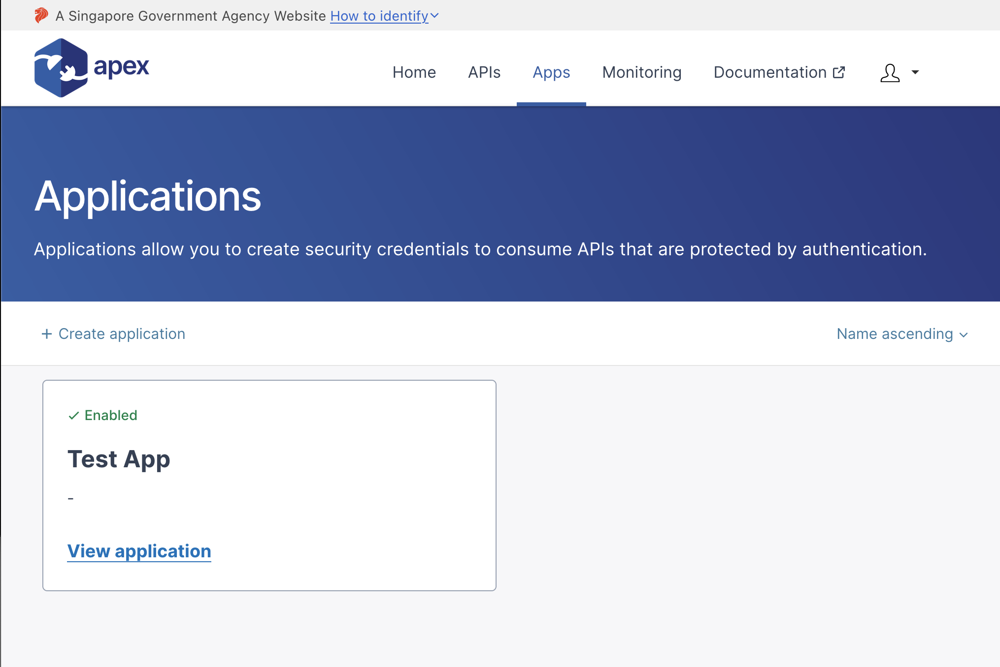
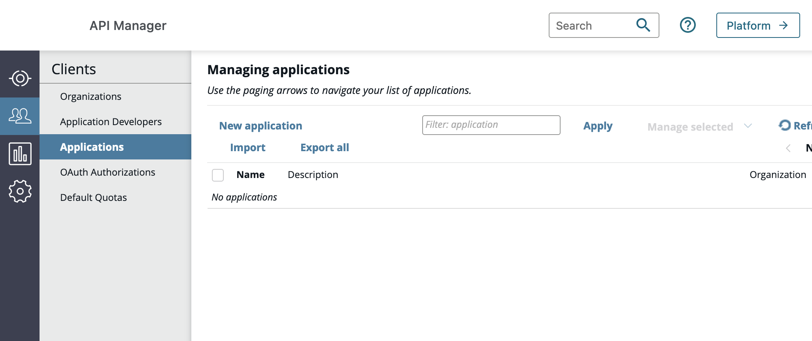
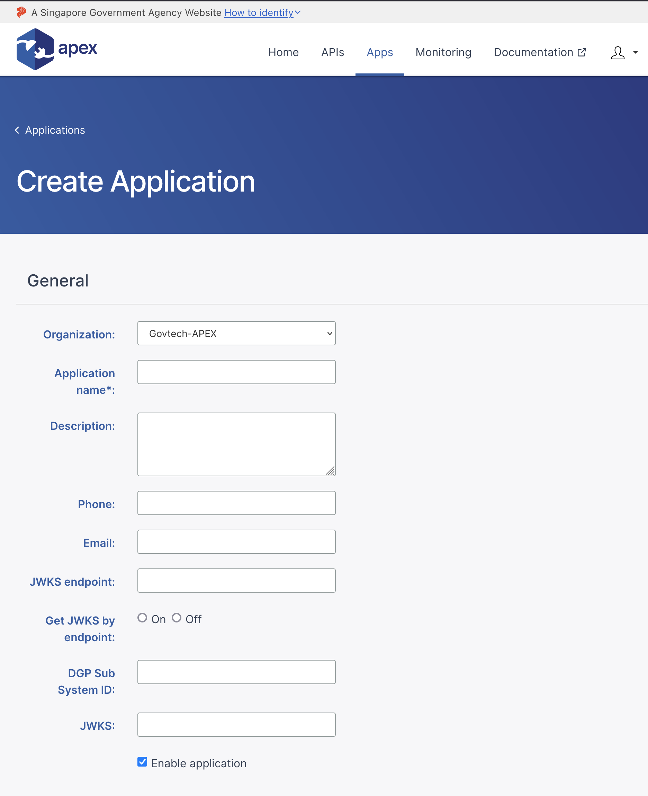
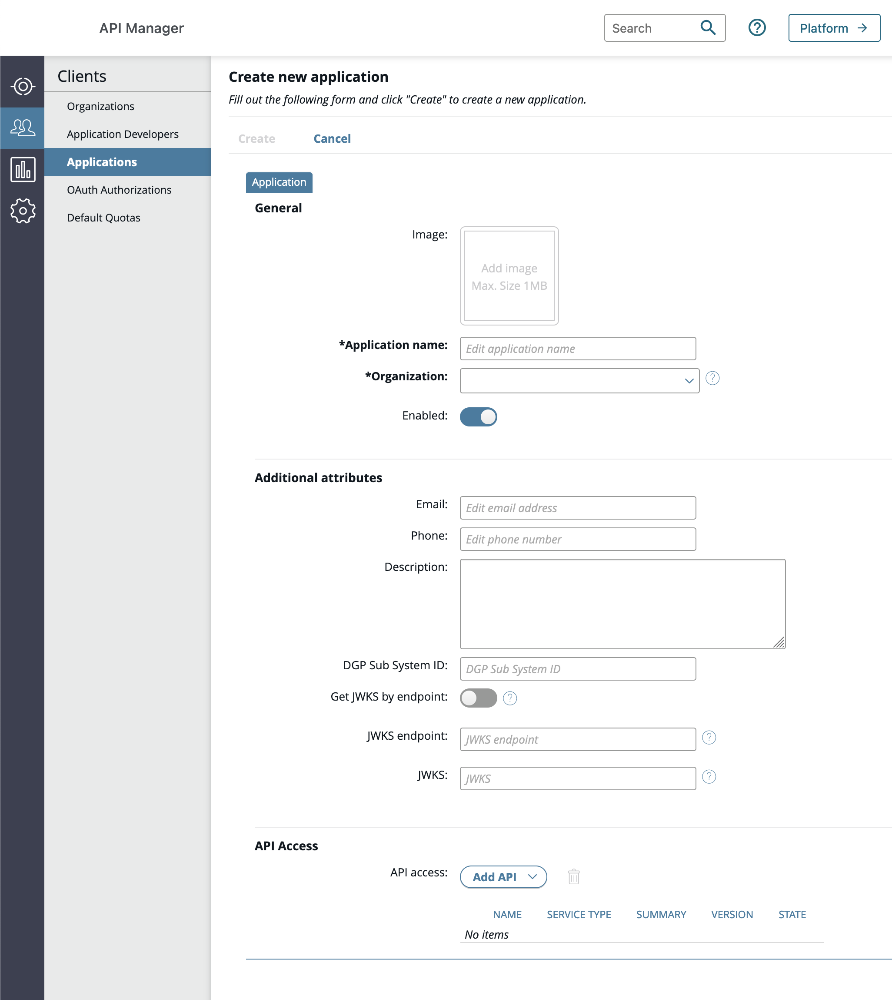
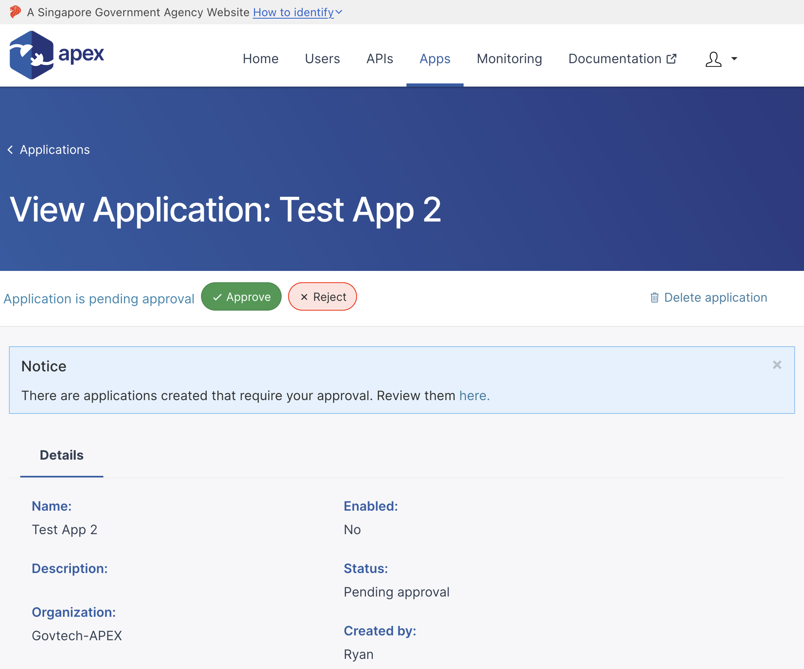
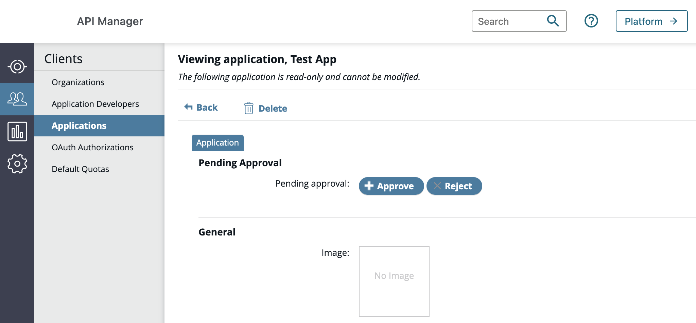
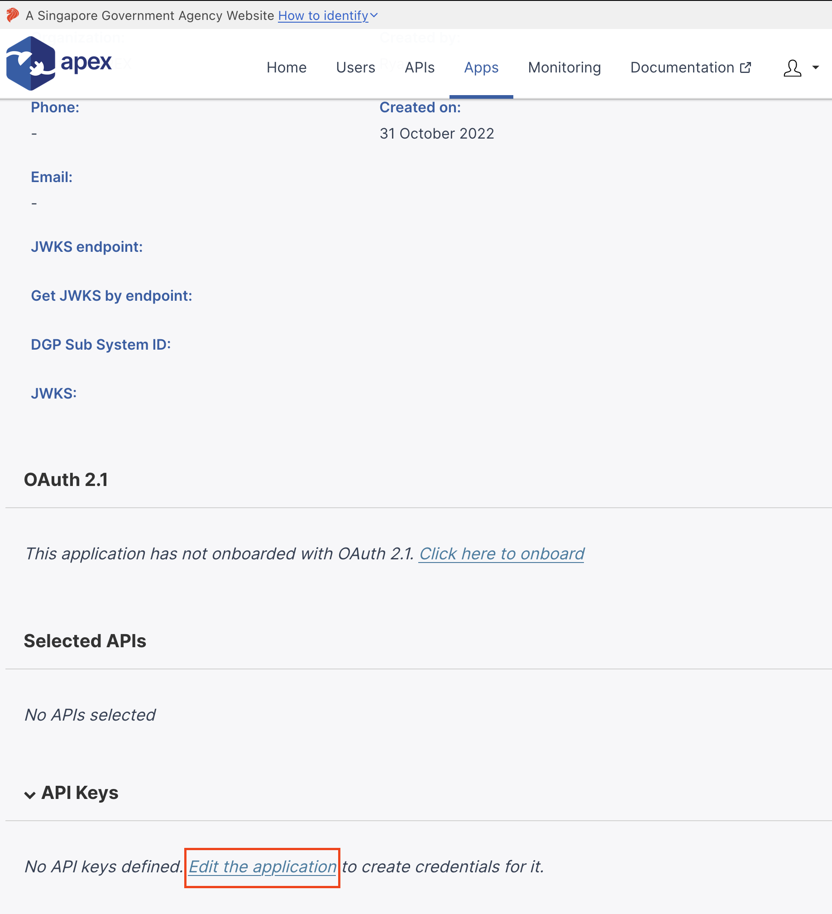
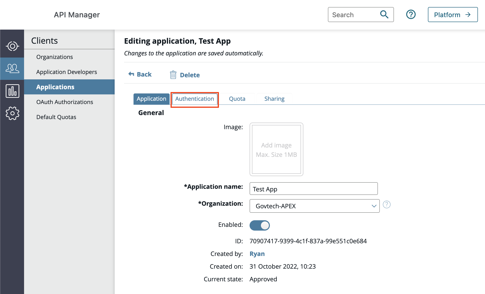
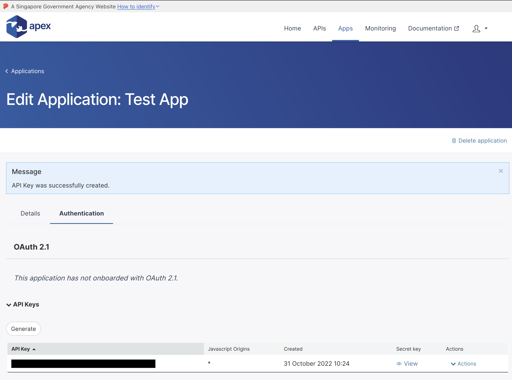
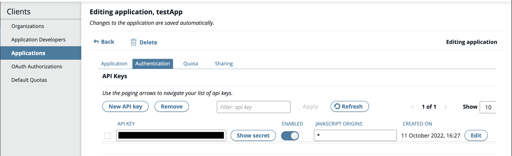

# Creating an application

Applications allow app developers to generate credentials (API Key, OAuth, or
external credentials) to consume APIs that are protected by authentication.

Once created, App developers can register the API use of their applications
through graphical real-time charts.

This guide will show both the API Developer Portal (if you are a Non-Government User) and the API Manager (if you are a public officer).

## Step 1 - Finding the Applications tab

The first step to consuming APIs, is to first create an application. This can be
found in the **Apps** tab in the menu bar.

## Step 2 - Creating the Application

By selecting the `Create application` or `New application` button, you will be redirected to a form page that allows you to create a new application (you may also select relevant APIs that are visible to you in this step):

| Field                | Description                                                                          |
| -------------------- | ------------------------------------------------------------------------------------ |
| Organization         | The organization that the app will be in                                             |
| Application Name     | The unique and identifier name of your app                                           |
| Description          | An optional description to help give context to the app you are creating             |
| Phone                | Contact information for your app                                                     |
| Email                | Contact information for your app                                                     |
| DGP Sub System ID    | The System ID that your app will be under (found in Digital Governance Platform)     |
| Get JWKS by endpoint | A toggle to choose if your app uses the JWKS endpoint field (On) or JWKS field (off) |
| JWKS endpoint        | URL Endpoint that has the jwks.json                                                  |
| JWKS                 | The actual JWKS (in the format of { "keys": [ {JWK_1}, {JWK_2} ] }')                 |

## Step 3 - Requesting approval for Application creation

After creating your application, it will be in the pending state, and you will need your organization admin to approve the creation before proceeding.
This is what organization admins will see in their own App view:

> You can proceed once your application has been approved. Do check in with your own organization admins and remind them if they have yet to do so

## Step 4 - Creating API Keys for your approved application

You can select the newly created (and approved) application to see its full details. 
If you are on the API Developer portal, scroll down to the API key section and select `Edit the application` to create the API Key
If you are on the API Manager, simply select the `Authentication` tab to proceed: 

Under the Authentication tab, click the `Generate` or `New API Key` button to auto-generate a new API Key Set for your application

