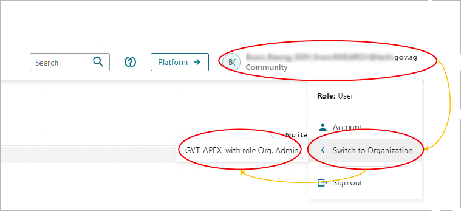
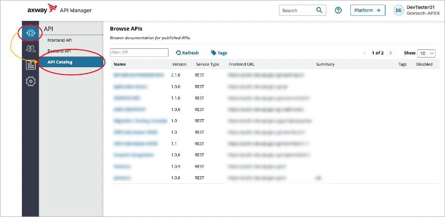
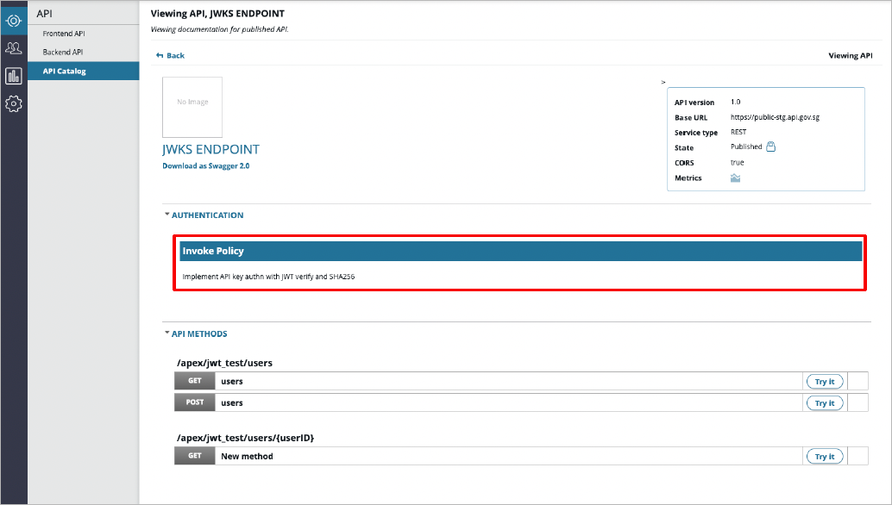

# Browse APIs

The organization you belong to determines which APIs you can access and use. Organizations are used to group APEX Cloud users, applications, and APIs.

## Check Organization

In API Manager, you can check the organization that is currently associated with your profile  by clicking **your username > Switch to Organization**.

## View API Catalog 

The API Catalog view contains a list of the APIs that are accessible to your organization.

You can view the API Catalog by going to **API > API Catalog**.

### View API Authentication Policy

To view an API's authentication policy, select the API in the API Catalog. On the API page, go to the **Authentication** section.

