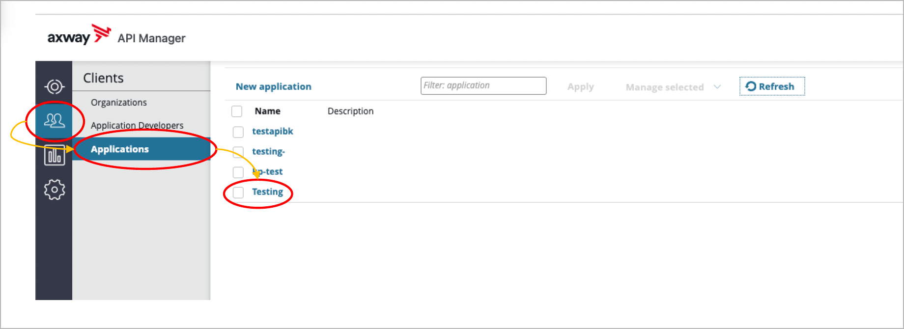
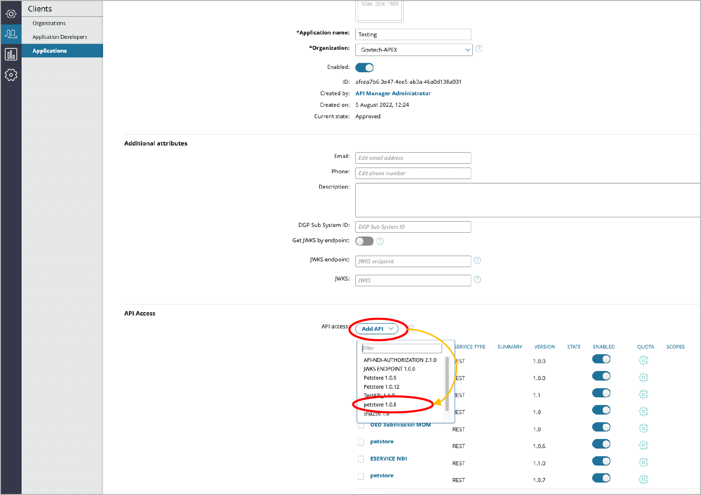

# Consume APIs

After your application is created, it can start consuming or getting access to available APIs.

1. Go to **Clients** > **Applications**, and select your application.

    

1. In the Application tab, go to **API Access** > select **Add API** > select the **API**. 

    

Your application will now have access to this API.