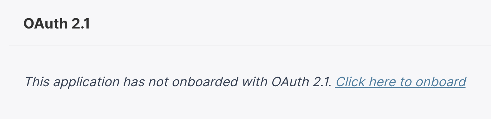
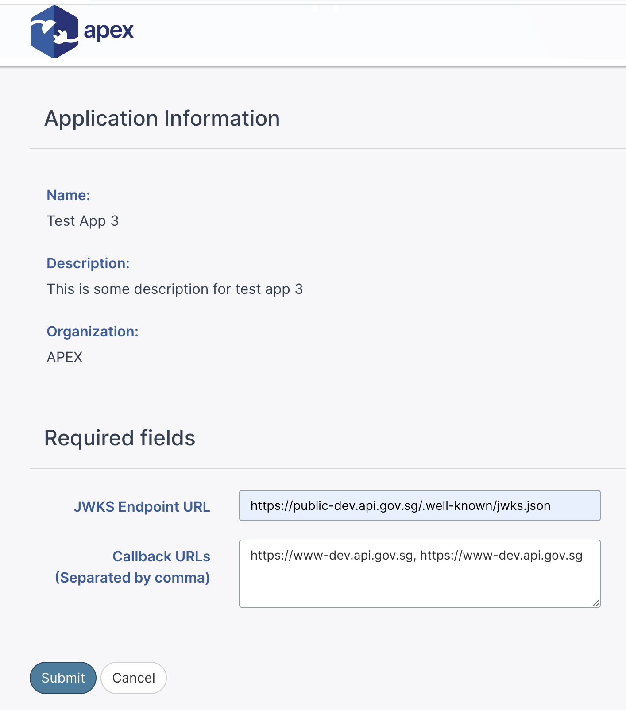
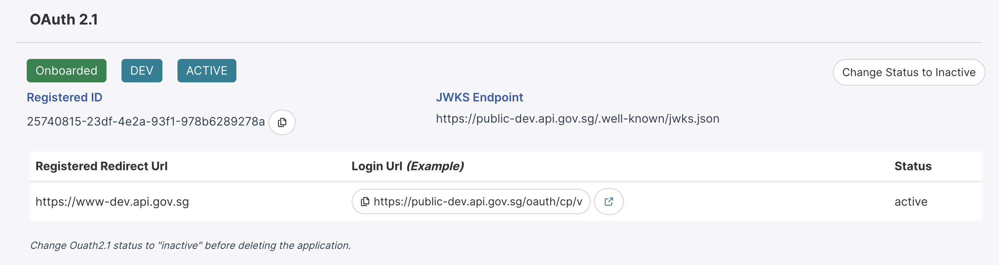
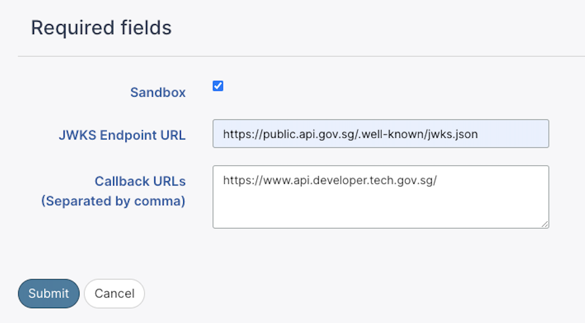
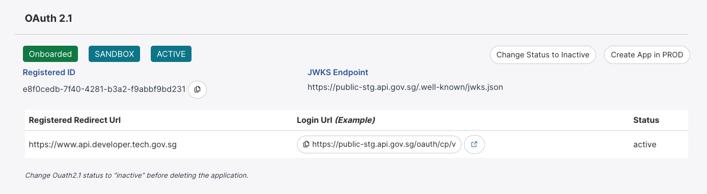
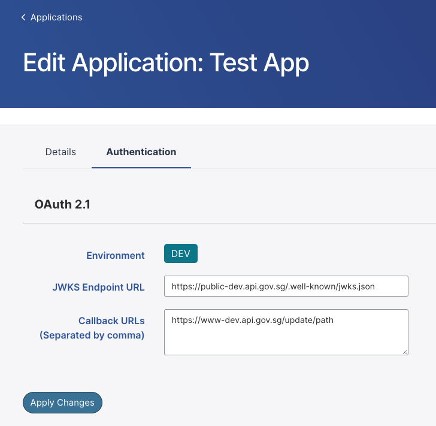
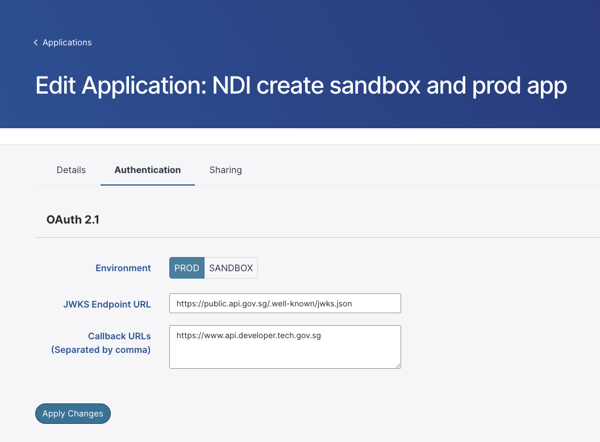

# Onboard to Oauth 2.1

## Onboard application

This section is only applicable to API Developer Portal users (Non-Government users).

1. Go to **Applications** tab > Select **Application**.

2. Search for **Oauth 2.1** > Click on **Click here to onboard**.

3. Add the **JWKS endpoint** and **callback URLs**.

   - Make sure the app description is not empty.
   - Multiple callback URLs are allowed with the seperation of comma.

   

4. Click **Submit**.

Once the application is onboarded successfully, the portal will be redirected back to the application page with respective ENV tag (e.g. DEV) in Oauth 2.1 section. The **Login Url (example)** is a demonstration on how the Login url can be constructed with the supplied callbacks. Replace the **scope** and **code_challenge** respectively for your application.

### Delete application

After the application is onboarded to OAuth 2.1, the portal will disable the function to delete the application. OAuth 2.1 status needs to be updated to **inactive** before you can delete the application.

1. Go to **Applications** tab > Select **Application**.
2. Search for **Oauth 2.1** > Click on **Change Status to inactive**.
3. Once the status become inactive, proceed to delete the application.

## (Sandbox) Onboard Application

SANDBOX is only available in PROD environment and the option will only be provided when onboarding to Oauth 2.1.

1. **Applications** tab > Select **Application**.

2. Search for **Oauth 2.1** > Click on **Click here to onboard**.

3. Check the **Sandbox** checkbox > Add **JWKS Endpoint URL** and **Callback URLs**

4. Click **Submit**.

Once the application is onboarded successfully, the portal will be redirected back to the application page with SANDBOX tag in Oauth 2.1 section.

### After onboarding to SANDBOX

After onboarding to SANDBOX, you can create an app in PROD with the same application.

1. **Applications** tab > Select **Application**.

2. Search for **Oauth 2.1** > Click **Create App in PROD**.

3. Add the **JWKS Endpoint URL** and **Callback URLs** > uncheck **Sandbox checkbox** (default option).

4. Click **Submit**.

5. Once onboarded to Oauth 2.1 in both SANDBOX and PROD environment, you can toggle between SANDBOX and PROD to view the details and registered ID in **Apps** tab > Select **Application**.

### After onboarding to PROD

After onboarding to PROD, you can create app in SANDBOX with the same appplication.

Apply the same steps in the [After onboarding to Sandbox section](#after-onboarding-to-sandbox). **Create App in SANDBOX** will appear in app > Oauth 2.1 section.

### Delete application

 The OAuth 2.1 status in both SANDBOX and PROD needs to be updated to **inactive** before you can delete the application.

1. Go to **Applications** tab > Select **Application**.
2. View **Oauth 2.1** > Click **Change Status to inactive**.
3. Click **Change to Sandbox** > Click **Change Status to inactive**
4. Once both of the status becomes inactive, proceed to delete the application.

## Update the JWKS Endpoint or Callback URLs

1. Go to **Applications** tab > Select **Application** > Click **Edit Application**.
2. View **Authentication** tab > **Oauth 2.1**
3. Update the **JWKS Endpoint URL** or **Callback URLs**.
4. Click **Apply Changes**.

5. If there are apps createed in both SANDBOX and PROD, select either **SANDBOX**** or **PROD** > Update **JWKS endpoint** or **callback URLs** > Click **Apply Changes**.

