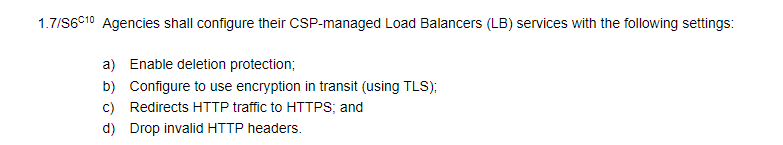

# I noticed that my customized headers are missing after calling APEX Cloud

API calls to APEX Cloud must conform to the regular expression `[-A-Za-z0-9]+` for any HTTP header names. HTTP Headers with names that do not conform to the expression `[-A-Za-z0-9]+` will be considered as invalid HTTP headers and will be dropped, in accordance to IM8 Cloud Security Section Para 1.7 S6.

You may refer to: [https://intranet.mof.gov.sg/portal/IM/Themes/IT-Management/Cloud/Topics/Cloud-Security.aspx](https://intranet.mof.gov.sg/portal/IM/Themes/IT-Management/Cloud/Topics/Cloud-Security.aspx) for more information.