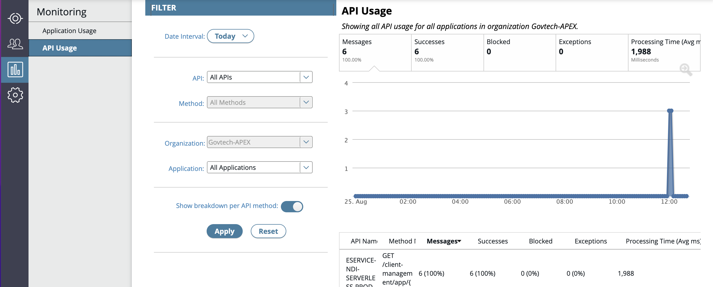
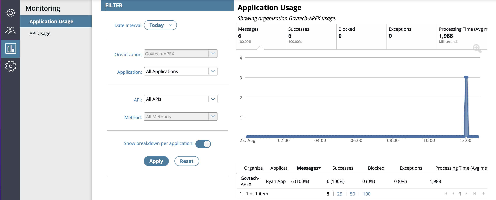

# API and APP Monitoring

## Monitoring metrics

- **Messages**: The number of messages processed by the selected API or client application.
- **Successes**: The number of successful messages processed.
- **Failures**: The number of failed messages processed.
- **Exceptions**: The number of messages that generated an exception in an API Gateway policy.
- **Processing Time (avg ms)**: The average time taken to process a message, including all calls to remote servers.

## Monitoring > API Usage

- When you **select specific API**, You are able to **select all or the selected method**.
- When the **Show breakdown per API method option** is selected, the table on the bottom right displays totals grouped by **API Name** and **Method Name**. Else, the table displays total grouped by **API Name** only.

## Monitoring > Application Usage

- When **Show breakdown per application** option is selected, the table on the bottom right displays total grouped by **Organization Name** and **Application Name**. Else, the table displays total grouped by Organization Name only.
- If you **select the row** in the table, the **graph is automatically updated** to contain data for the selected row only. if no rows are selected, the chart is contain data for all the rows.
- Unlike the display in table, the **graph will display the same data**, regardless of whether the show breakdown settings are selected.

