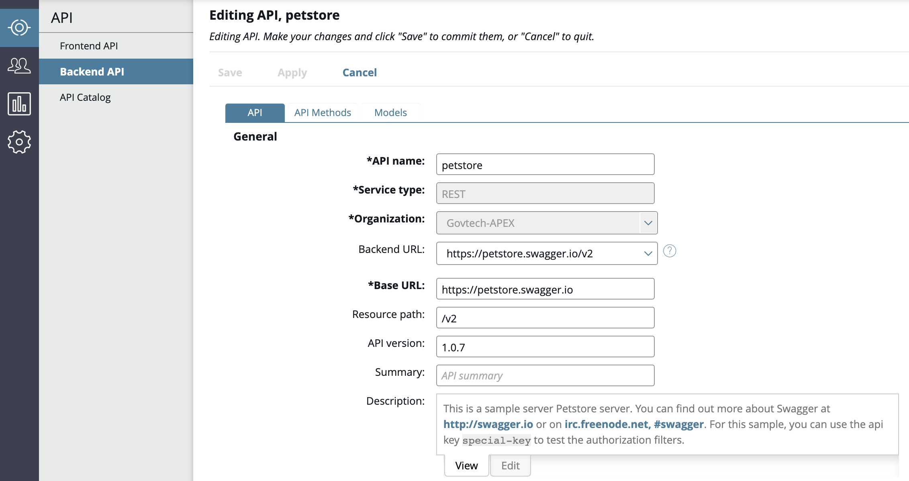
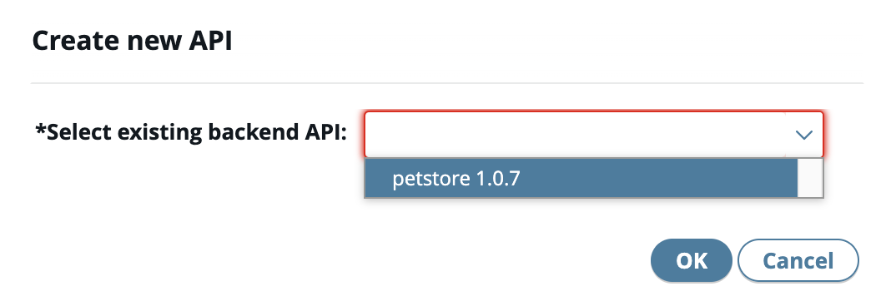
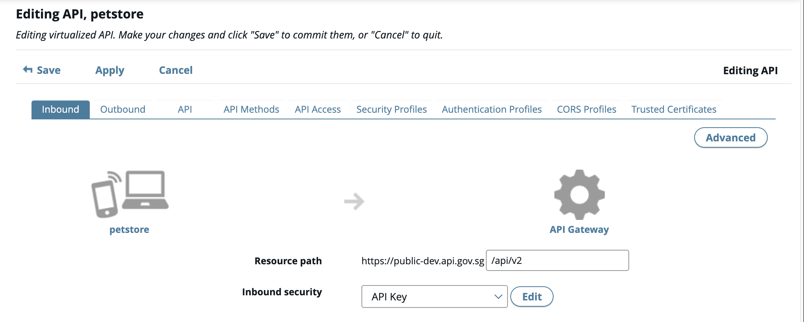
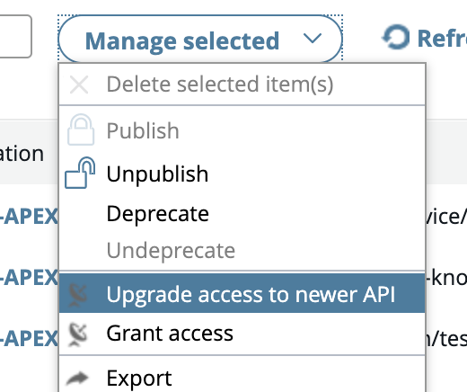
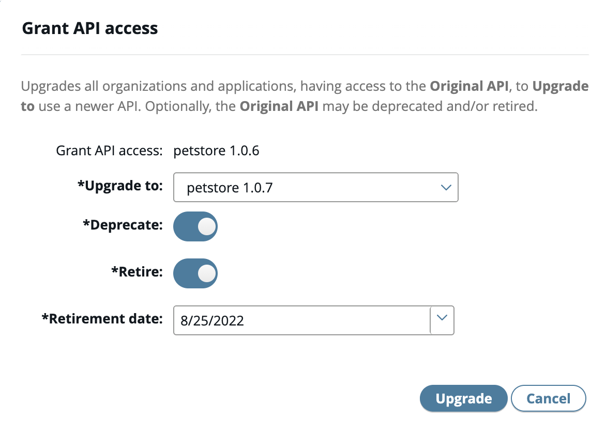
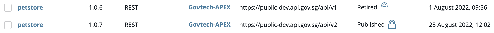

# API Versioning

1. [Create new API](docs/publisher/create-api.md).

2. Import **updated API** and [publish](docs/publisher/publish-api.md) it.

3. **Specify the version** in the path (e.g. /api/v2). This is optional but it is the recommended way of creating same API with different versions.

4. Select the older API > click **Manage selected** > choose **Upgrade access to newer API**.

5. In the **upgrade dialog**, complete the following:

- **Upgrade to**: Choose the new API.
- **Deprecate**: Enable it to indicate if API is deprecate.
- **Retired**: Enable it to retired API and select date to retired it.
  

6. Click **Upgrade**. If today's date is selected, the API will be retired immediately.

Note:

- Consumer will be able to see deprecated API(s).
- Only Publisher will be able to view their own retired API(s).
