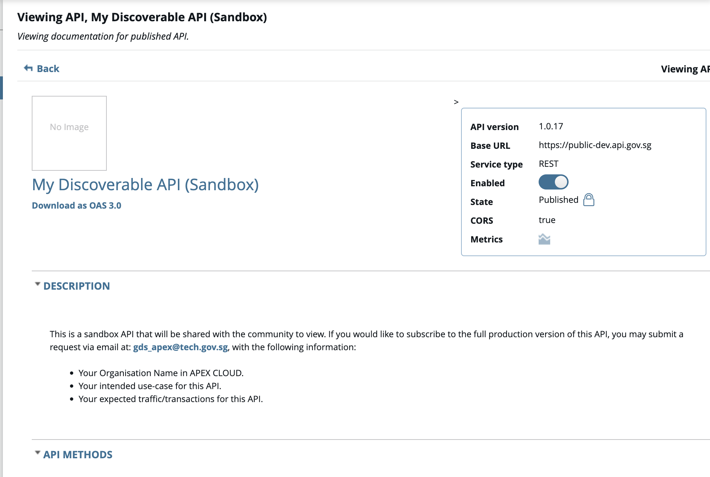
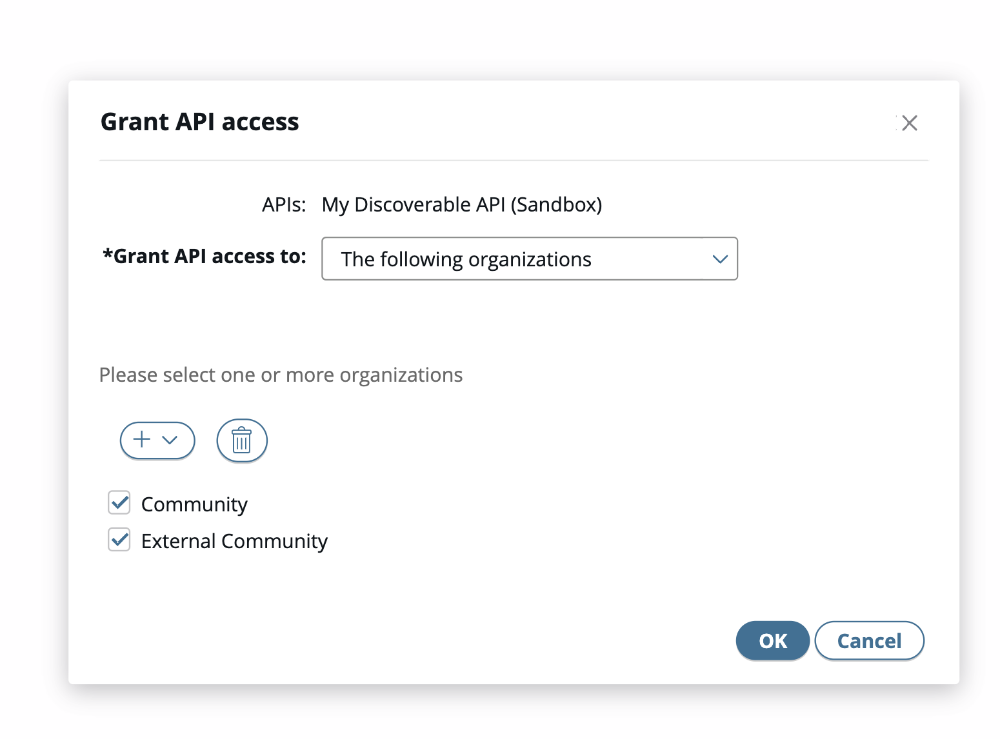

# Making your APIs discoverable

Once you have finished publishing your API(s), a possible next step for your organisation is to let others (WOG and even external public users) be aware of your API(s). 

> As seen in the previous section [(Manage Access to APIs)](/docs/publisher/manage-access-to-apis.md), APIs are only visible to the organisations (and their users) that have been given access to the API. Every other organisation will neither be able to interact with, nor see the API.

In order to make your APIs discoverable, you may follow the preferred workflow below:

## 1. Creating a Sandbox version of your API

The first step is to create and publish a sandbox version of your API. This could point to a non-production environment or even mock/seeded data. Generally, you should include a good description of the nature of the API and instructions for your target users to follow up on if they would like to subscribe to the actual API
*(Refer to the screenshot below for an example of a published sandbox API)*

At this point, your Sandbox API may have been published, but it is still yet discoverable. The next step is where we will share this API to our target audience

## 2. Giving access to the Sandbox version of your API

APEX Cloud segments all the users into 2 main groups (aside from their actual organisation), namely:

> **Community**: WOG Users

> **External Community**: Corppass Users / Non-WOG User

Based on your business needs, you may opt to give access to either groups (or even both)

Once you have given access to the groups, the users will see the sandbox API when they log into the portal.