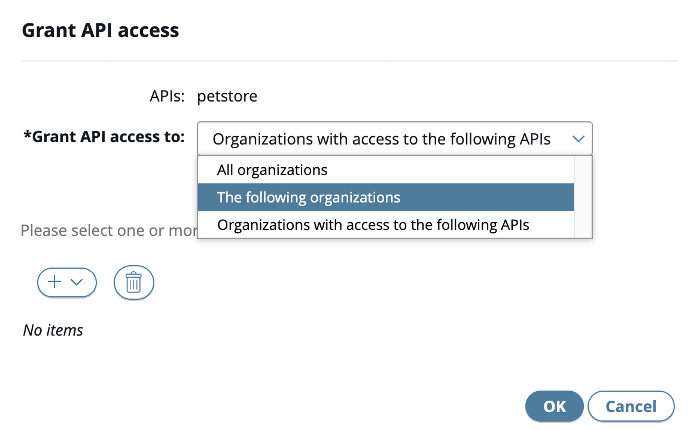
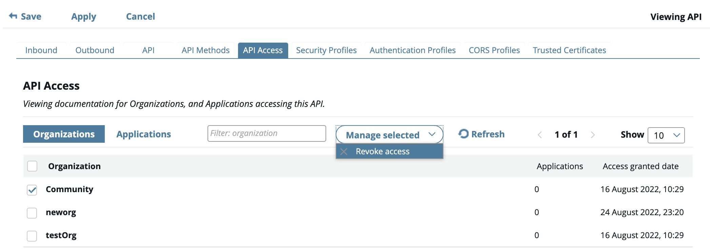

# Manage Access to APIs

## Grant access to an API

1. Click **Frontend API** view in API Manager, then select one or more APIs from the list.
2. Click the **Manage selected** drop-down list, then choose **Grant** access.
3. Choose an option in the **Grant API access dialog** dialog box, then click **OK**.

## Revoke access to an API

1. Click **Frontend API** view in API Manager and select an API from the list.
2. In the details of the API, click the **API Access** tab.
3. From the **Organizations** tab, select the organizations you wish to revoke access.
4. Click the **Manage selected** drop-down list, and select Revoke access.
5. Click **Revoke** in the **Revoke API Access** dialog box to confirm the operation.

Note:

- You are not able to revoke your own organisation.
- Revoke access will automatically remove the access from all applications that belongs to the organisation

## View list of organisation with access to the API

1. Click **Frontend API** view in API Manager, then select an API from the list.
2. In the details of the API, click the API Access tab. A table containing two tabs, **Organizations** and **Applications**, is shown.
