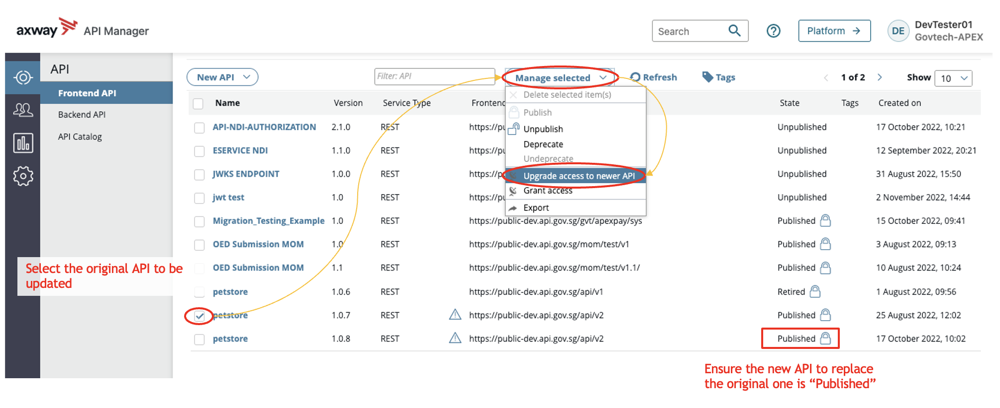
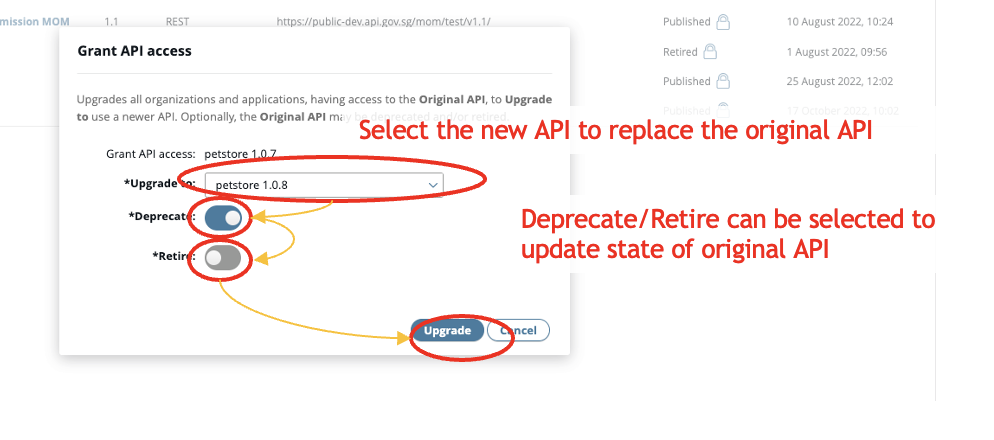
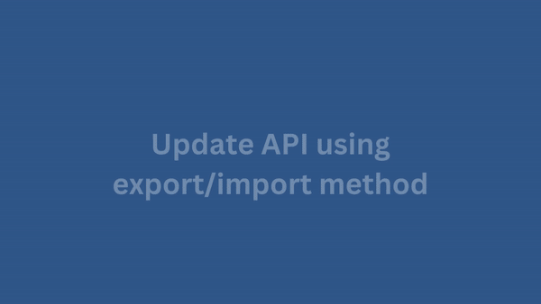

# Update API

## Update API with zero downtime

It is not possible to make any changes to an API in published state. What we recommend is to upgrade your API. By upgrading your API it provides a seamless integration of your API changes to the consumer, as long as your changes is not a breaking change.

> If you were to unpublish your API and update the API, a full reintegration of the API with the consuming APP is not possible without consumer's intervention. This will cause the API calls to fail.

1. Create API to recreate the backend API with the necessary changes (if any), follow the [Create API](docs/publisher/create-api.md) steps. Do update the version number, to reflect that this is of a later version.

2. Publish API to recreate the frontend API with the necessary changes (if any), follow the [Publish API](docs/publisher/publish-api.md) steps. Please ensure that the setup of the frontend API is similar to that of the original version.

3. Upgrade access of original API to new API by selecting the **original API > Manage selected > Upgrade access to newer API**

A pop up will appear to select the newly created API to upgrade original API to.

## Update API using export and import method

For minor API updates, such as updating the API description while keeping the same parameters, you can export your existing API and import it as a new version.

1. Export API as a .dat file.

    a. Click **API > Frontend API view > Select API** in API Manager. 
    b. Click **Manage Selected > Export**. 
    c. In the Export API dialog, enter the password to use for encryption, then click **OK**.

2. Import the exported API. Follow the [Import API via .dat file](https://docs.developer.tech.gov.sg/docs/apex-cloud-user-guide/docs/publisher/publish-api?id=import-api-via-dat-file) steps.

3. Click **API > Frontend API view** and click the imported API in API Manager. In the API tab, edit the **API version** and click **Save**.

    Note: You can also make other necessary changes in this step. 

4. Publish the new API version. Follow the steps in [Publish API](https://docs.developer.tech.gov.sg/docs/apex-cloud-user-guide/docs/publisher/publish-api?id=publish-api).

5. Upgrade the access of the original API to the new API by selecting the **original API > Manage selected > Upgrade access to newer API**. You can refer to the details in the previous section, [Update API with zero downtime](#update-api-with-zero-downtime).
