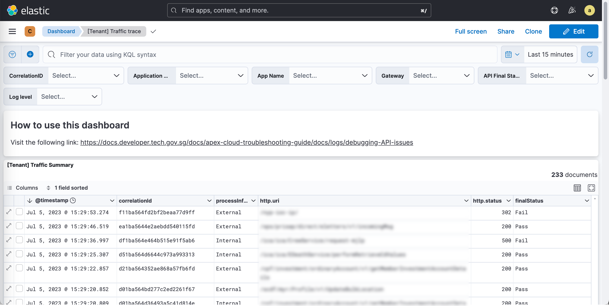
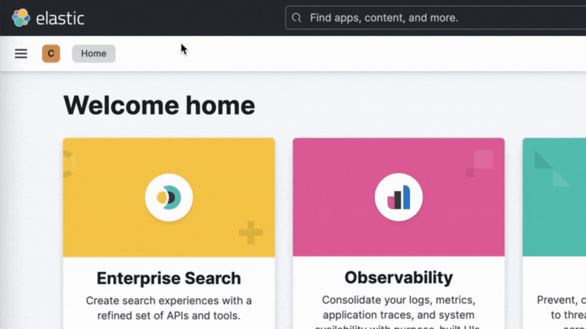
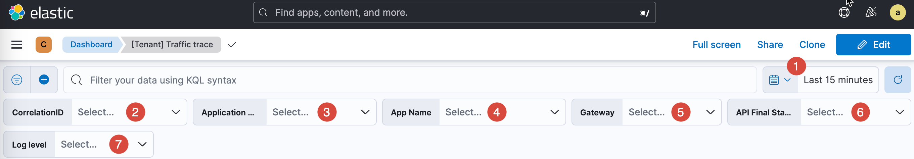
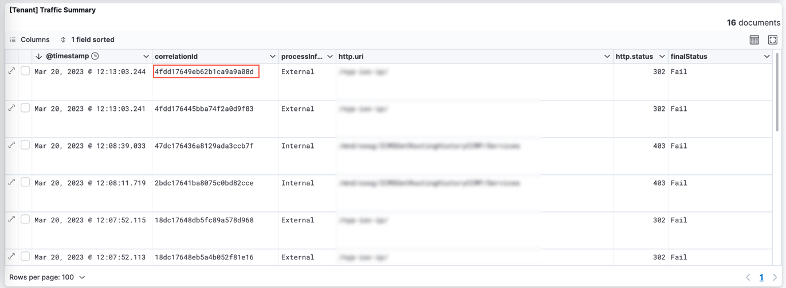
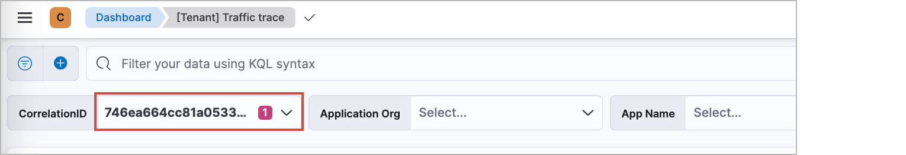
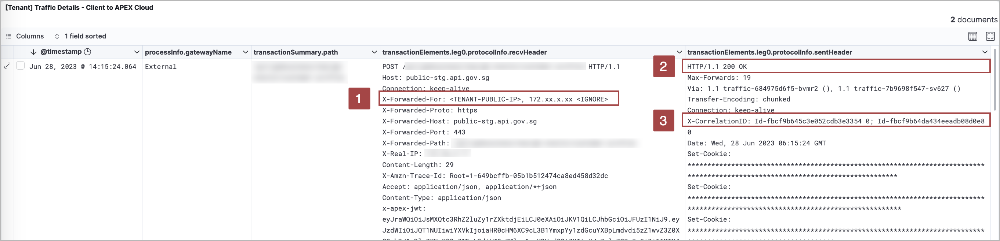
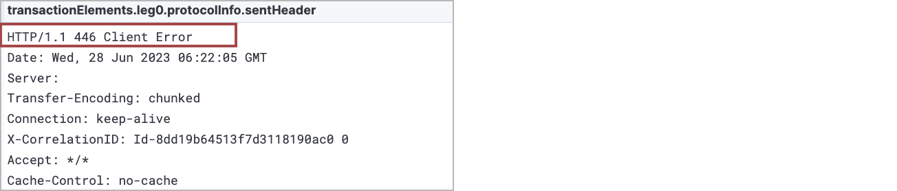
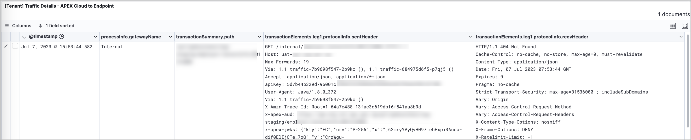
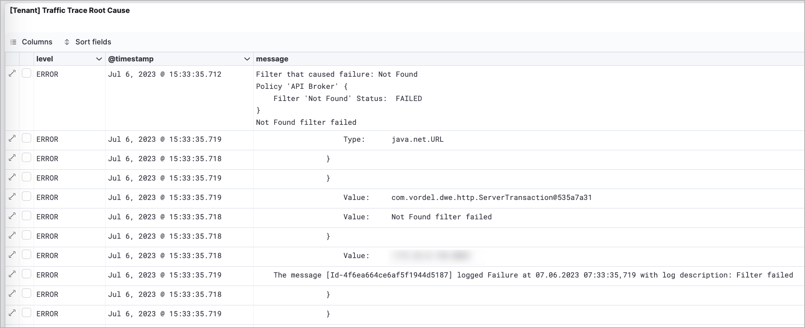
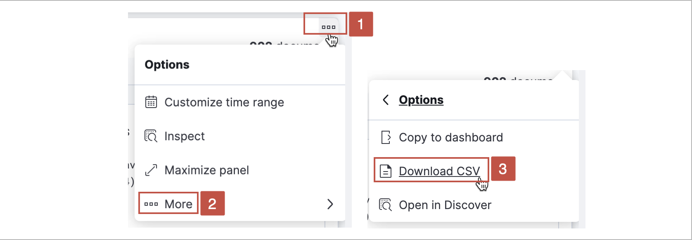

# Debugging API request issues

To debug a problematic API request, you can trace the request using the Traffic Trace dashboard.

1. View the [Traffic Trace dashboard](#view-the-api-traffic-trace).
2. View the [Traffic Details](#view-the-traffic-details).
3. View the [Traffic Trace Root Cause](#view-the-traffic-trace-root-cause).

The steps above are all linked to the Correlation ID value. When an API request is made, a unique Correlation ID is generated and attached to the request message. By tracing the Correlation ID and view the logs related to that ID, you can  pinpoint the source of the error or issue and identify the root cause of the problem.

The Traffic Trace Dashboard helps you view and filter the list of the Correlation IDs and the details of each API request. 

The dashboard consists of four panels.

| Panel | Description |
| --- | --- |
| **Traffic Summary** | Lists all the Correlation IDs that occurred in a specific time range. The API requests are listed by  Correlation ID. |
| **Traffic Details - Client to APEX Cloud** | Shows the detailed results of the queried API endpoints specifically for the request between the Client and APEX Cloud. |
| **Traffic Details - APEX Cloud to Endpoint** | Shows the detailed results of the queried API endpoints specifically for the request between APEX Cloud and the Endpoint. |
| **Traffic Trace Root Cause** | Shows the trace level for the  queried API. The details provided in this panel are used to debug the API request.

## View the API Traffic Trace

To debug an API issue using the [Traffic Trace dashboard](#debugging-api-request-issues), follow these steps:

### Step 0: Complete the prerequisites

Ensure that you have:

- An active [TechPass](docs/onboarding/techpass) account.
- Access to your Elastic Cloud deployment.

### Step 1: View the Traffic Trace dashboard

1. Access your StackOps account.

    - **Production:** [go.gov.sg/apex-report](https://go.gov.sg/apex-report)
    - **Staging:** [go.gov.sg/apex-report-stg](https://go.gov.sg/apex-report-stg)

1. Log in with [TechPass](docs/onboarding/techpass). The Elastic Cloud dashboard is displayed.

1. From the Spaces menu, select your project space.

1. From the main menu, go to the Analytics category and click **Dashboard**. A list of available dashboards are displayed in the Dashboards page.

1. From the list of dashboards, click **Traffic trace**. The Traffic Trace dashboard is displayed.

### Step 2: Find the Correlation ID

1. On your Traffic Trace dashboard, configure the dashboard filters to narrow down the list of API requests in the Traffic Summary panel.

    > **Note:** You can choose to skip this step and proceed to browse the list of API requests in the Traffic Summary panel. These requests will be sorted based on the default time range that is set in your dashboard.

    

    | Filter | Description | Used for |
    | --- | -- | -- |
    | **(1) Time range** | Specifies the time range that the API was processed. | All panels
    | **(2) CorrelationID** | Filters or identifies a specific API request in a query. | All panels
    | **(3) App Org** | Filters the requests by application's consumer  organisation | Traffic Summary panel
    | **(4) App Name** | Filters the requests by application name | Traffic Summary panel
    | **(5) Gateway** | Filters the gateway type by either **internal** or **external** values. | Traffic Summary panel
    | **(6) API Final Status** | Filters the status of the request by either **Pass** or **Fail** values. | Traffic Summary panel
    | **(7) Log level** | Filters the log levels in the Traffic Trace panel. | Traffic trace panel |

2. Browse through the list of API requests in the Traffic Summary panel, and copy the **Correlation ID** of the problematic request.

    

    > **Note:** You can also hover over the Correlation ID entry and  click the (**+**) icon to filter the results by that value.

### Step 3: Debug the problematic request

?> Make sure to clear any filters that you used to find the Correlation ID.

1. In the Correlation ID filter, paste the value of the Correlation ID that corresponds to the problematic API request.

    

1. After filtering by the Correlation ID, debug the request using the **Traffic Details** and **Traffic Trace Root Cause** panels. Proceed to the next sections.

## View the Traffic Details

To debug the issue by checking the Traffic Details, follow these steps:

1. In the Correlation ID filter, paste the value of the Correlation ID that corresponds to the problematic API request. Make sure to clear any filters that you previously used to find the Correlation ID.

1. Scroll down to the **Traffic Details - Client to APEX Cloud** and **Traffic Details - APEX Cloud to Endpoint** panels. From here, you can trace the traffic details of the request.

### Client to APEX Cloud panel

Use this panel to determine whether an API request is experiencing failure on the Client to APEX Cloud segment of the request (Leg 0).  
    

- The **X-Forwarded-For** (**1**) header verifies the Client IP address.

    **Syntax** 
    `X-Forwarded-For: <TENANT-PUBLIC-IP>, <proxy1>, <proxy2>`

    The `TENANT-PUBLIC-IP` value refers to the Source IP address of the application that initiated the API request.

- The **HTTP response** (**2**) shows the HTTP response. In the example below, the response shows a `446 Client Error`.

    

- The **X-CorrelationID** (**3**) header determines that the API is a **Bridging API** if there are two correlation ID values. Bridging APIs can be:
  - Backend-hosted in Intranet and exposed in Internet
  - Backend-hosted in Internet and exposed in Intranet

### APEX Cloud to Endpoint panel

Use this panel to determine whether an API request is experiencing failure on the APEX Cloud to Endpoint segment of the request (Leg 1).  

## View the Traffic Trace Root Cause

To debug the issue by checking the Traffic Trace Root Cause, follow these steps:

1. In the Correlation ID filter, paste the value of the Correlation ID that corresponds to the problematic API request. Make sure to clear any filters that you previously used to find the Correlation ID.

1. Scroll down to the Traffic Trace Root Cause panel and check the details in the message column. From here, you can trace the events and the root cause of the issue.

    

### Export the trace logs

To export the track trace logs in `.csv` format, follow these steps:

1. Hover over the upper right area of the Traffic Trace panel and click the menu icon.

1. Click **More**.

1. Click **Download CSV**.

    
