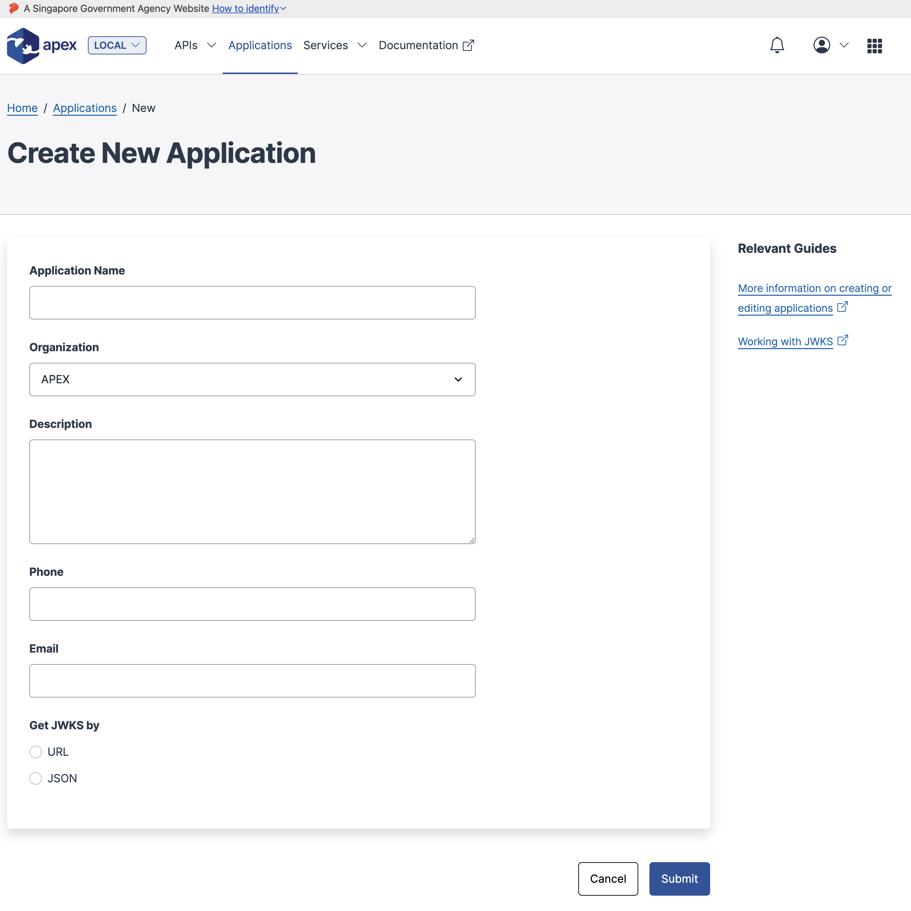
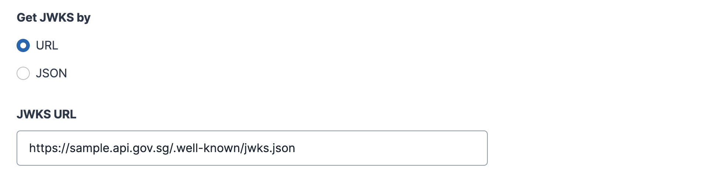

# Setup for JWKS Endpoint

In the previous section we covered what basics of JWKS endpoint. To use the JWKS Endpoint for APEX, the following setup steps will be required.

You may begin this workflow by navigating through either flows:

`Applications` &rarr; `Clicking on [+ New Application]`

`Applications` &rarr; `Clicking on [Existing Application of choice]` &rarr; `Clicking on [Edit Details]`

## External Zone

If you are a consumer of APEX API in the external (internet zone), you would just need to configure the JWKS endpoint in your Application and toggle to "Get JWKS by [URL]", and the field for the JWKS URL will present itself.

Your TLS JWKS endpoint will need to be signed by a supported common trusted public root CA. Self-signed endpoints are not supported.

## Internal Zone

If you are a consumer of APEX API in the internal (intranet zone), you would just need to configure the JWKS endpoint in your Application and toggle to "Get JWKS by [URL]", and the field for the JWKS URL will present itself.

Your TLS JWKS endpoint will need to be signed by a supported common trusted public root CA or by SGCore's root CA. Self-signed endpoints are not supported. Recommended CAs can be found [here](/sections/support/trusted-cert-authorities.md).

The next section will describe action(s) needed for APEX to access your JWKS endpoint in the internal zone.

### GCC 1.0 AWS Intranet, Azure Intranet, GCP Intranet

There is no need to clear any firewall between the cloud zones and you would just need to ensure that APEX's internal IP addresses is whitelisted/not blocked in any cloud security groups. Do raise a service desk request to get the IP addresses.

### GCC 2.0 AWS Intranet

There is a need to set routes in your cloud environment. Do raise a service desk request to get instructions for setting routes in your zone.

### GEN and any linked networks

There may be a need to clear firewall(s) from the CLZ to your server. Do raise a service desk request to get instructions for clearing the relevant firewall(s).
