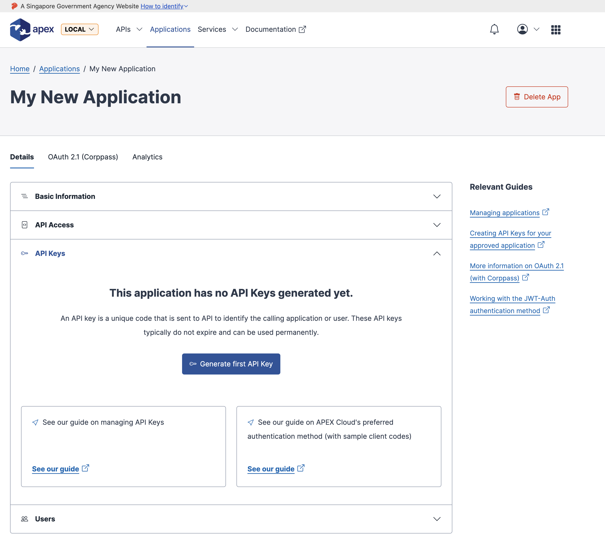
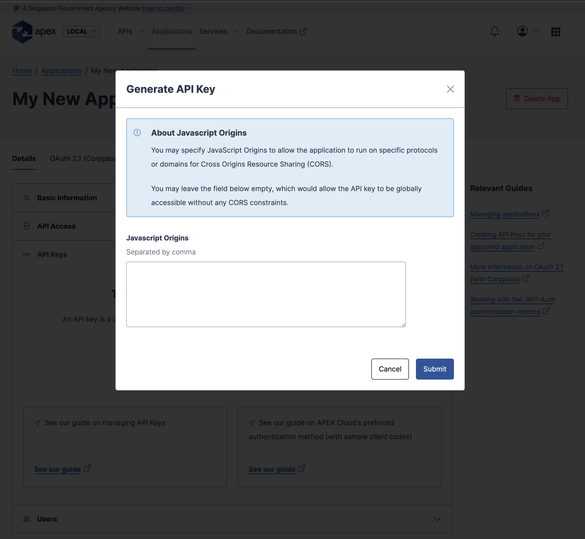
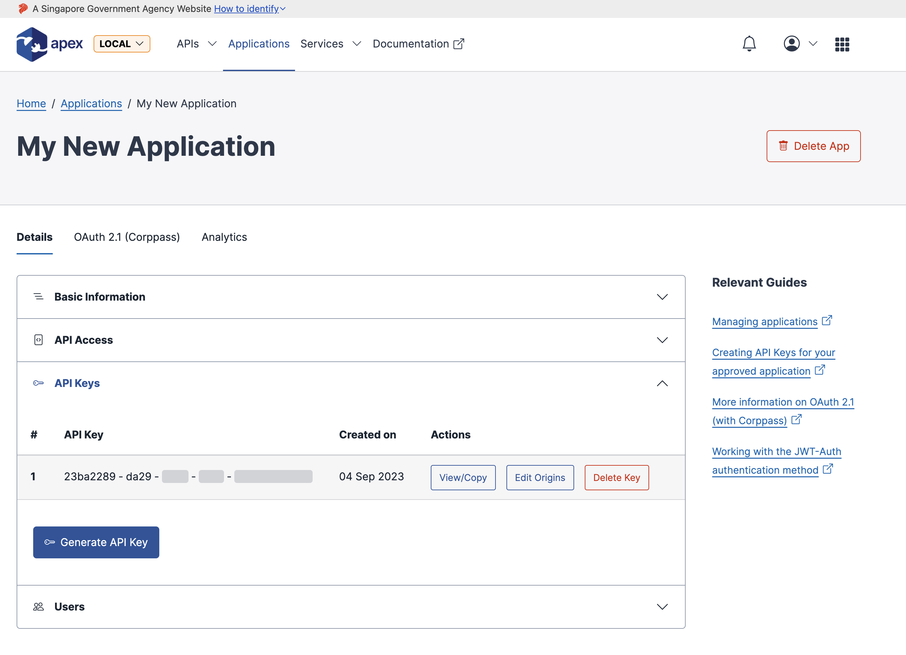

# Creating API Keys for your application

A major component for working with the typical inbound security mechanisms of the APIs behind the APEX Cloud API Gateway, is the application's API Key.
You may begin this workflow by navigating through:

`Applications` &rarr; `[Application of choice]` &rarr; `API Keys Tab`

By clicking on the `Generate API Key` button, you will be prompted to (optionally) bind the upcoming API Key to a limited list of allowed origins.
You may leave this empty to allow this upcoming API key to be freely accessible

Upon submitting the modal form, a new API key will be generated for you (and will be partially masked to not full reveal the key in the open).

> By hovering over the masked content, the hovered segment will be revealed

Here, you may freely copy the API key and use in it your actual client applications.