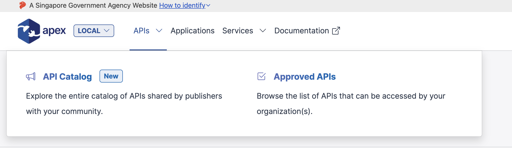
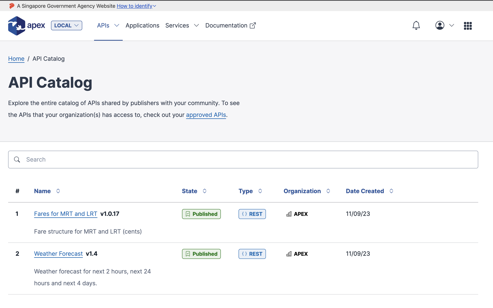
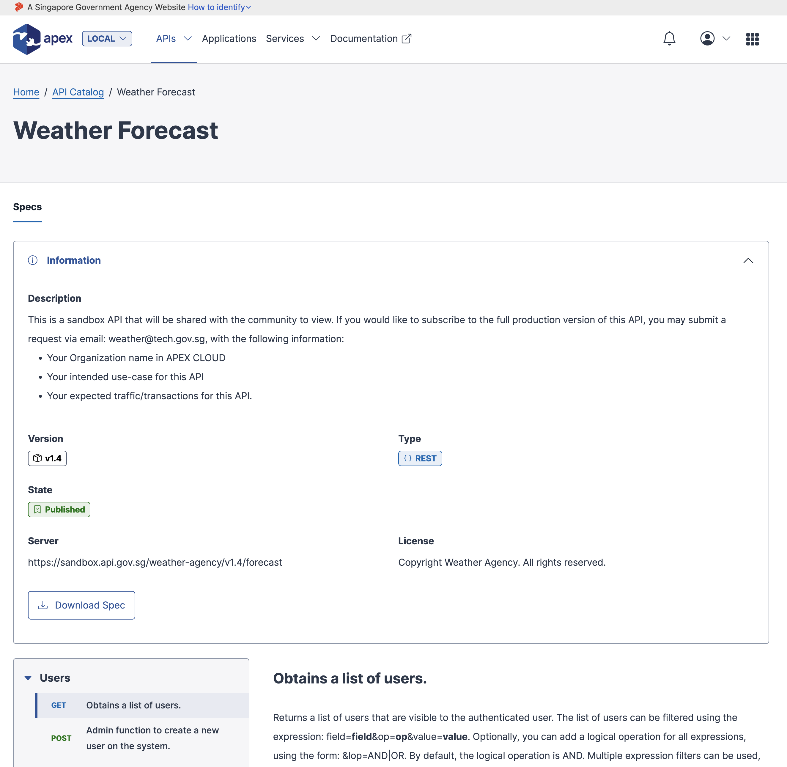
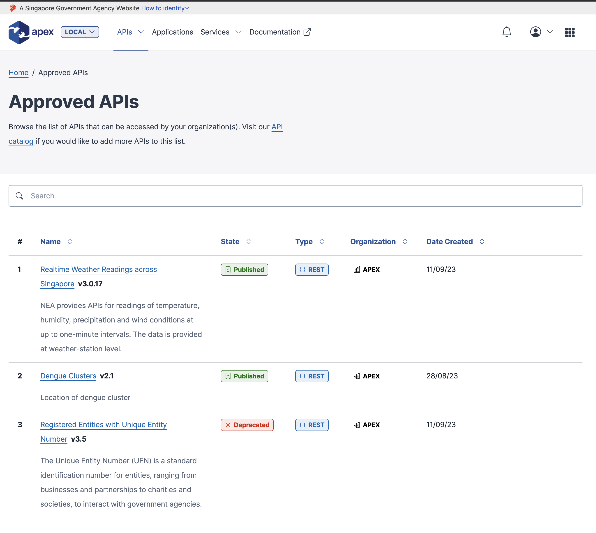

# Browsing APIs

APEX Cloud lets you connect and explore existing APIs that have been published to our API Gateway. Here you have the 2 modes of API viewing:

## 1. Discover APIs through the API Catalog

These APIs are often sandbox APIs that the publishers have shared with the community as a whole for developers to discover and see if the API fits their development requirement.

By clicking through the API in the Catalog, you may typically find instructions on requesting production access to the live API.

!>  In some cases, APIs are not shared with the community (and therefore not discoverable). However, you may reach out and contact publishers directly to request access to their APIs if you happen to learn about their APIs outside of the APEX Cloud portals.

Once the Publishing Organization of the API approves your request to allow access to the live API, you will find the API in the **Approved APIs** page, which is the next mode of API viewing.

## 2. View and subscribe to APIs in the Approved API list

The Approved APIs page contains a list of the APIs that are accessible to your organization(s). Here, because at least 1 of your organizations has access to these APIs, you may view and subscribe your [applications](/sections/consuming/introduction.md) to the API.

