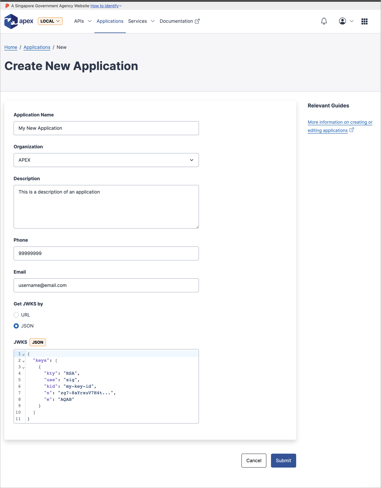

# Creating an application

Applications allow app developers to generate credentials (API Key, OAuth) to consume APIs that are protected by authentication.

## Step 1 - Finding the Applications page

The first step to consuming APIs, is to first create an application. You may begin this step by navigating to the apps page (found in the **Applications** tab in the navigation bar), and by clicking on the `Create Application` button.

## Step 2 - Creating the Application

In the `Create New Application` page, you will be presented with a form to be filled before an application can be created.

| Field            | Description                                                                                                  | Remarks                    |
| ---------------- | ------------------------------------------------------------------------------------------------------------ | -------------------------- |
| Application Name | The unique name that identifies your application                                                             | Required                   |
| Organization     | The organization that the app will be in                                                                     | Required                   |
| Description      | To give context to the app you are creating                                                                  | Required                   |
| Phone            | Phone contact information for your app                                                                       |                            |
| Email            | Email contact information for your app                                                                       |                            |
| Get JWKS by      | To select the choice on how your application will maintain its JWKS (Will toggle between the 2 fields below) |                            |
| JWKS URL         | A publicly accessible URL that has the jwks.json                                                             | If URL option is selected  |
| JWKS JSON        | The actual JWKS (in the format of { "keys": [ {JWK_1}, {JWK_2} ] }')                                         | If JSON option is selected |

## Step 3 - Requesting approval for the newly created application (If required)

If you are not an organization admin, and when you have successfully submitted the form to create a new application, you will notice that your new application is in the pending state.

Here, you will not be able to continue the application workflow (creating API Keys, subscribing to APIs) until an organization admin approves your application.

> Do check in with your own organization admins and remind them if they have yet to do approve your application through their inbox:
>
>  
