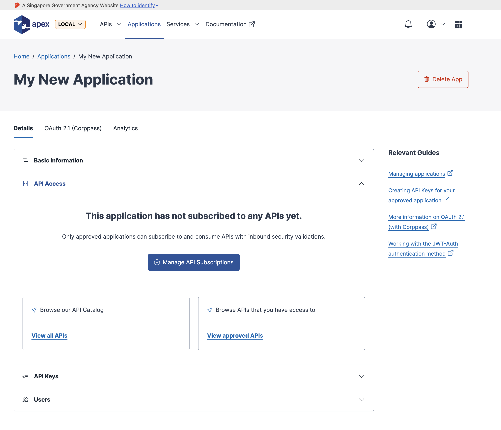
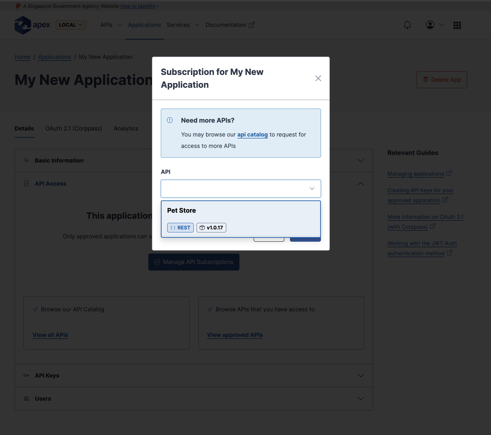
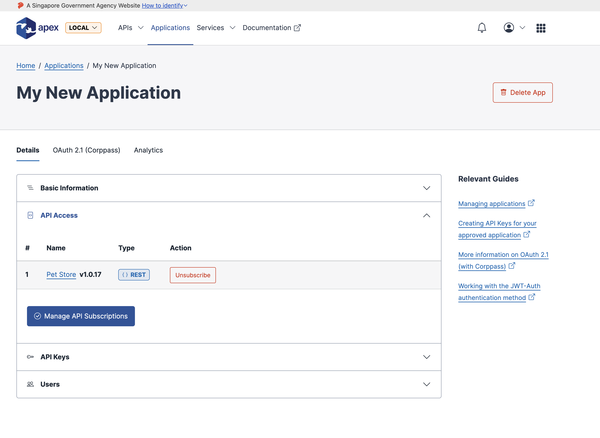

# Subscribing applications to APIs

Before an API key of an application can be allowed entry to access an API, it first has to be subscribed to that API.

`Applications` > `[Application of choice]` > `API Access`

By clicking on the `Manage API Subscriptions` button, you will be prompted to select an API (that your organization has access to) to subscribe to.

Upon submitting the modal form, your application will be subscribed to the API. You may repeat this steps multiple times if you required access to multiple APIs.
