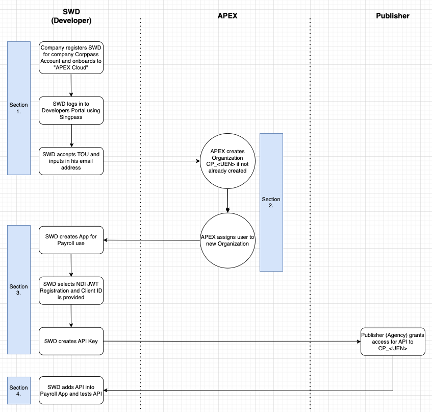

# Onboarding and Setup for Consumers (SWD)

These are the steps for onboarding and setup for application development using Apex Cloud. Nomenclature for this document can be found [here](sections/oauth/nomenclature.md).

The swim-lane is shown below.

Generally it consists of 3 sections: **_Corppass Setup_**, **_APEX Setup_**, **_Application Setup_**.

The onboarding steps are as below:

## 1. Corppass Setup

The software developer (SWD) will often need to simulate the payroll process and role-play the company submitter.

The Company which is registered with Corppass (which SWD is in) will need to [register the User (SWD) to the Corppass Digital Service (e-service ID) - **"Apex Cloud"**](sections/onboarding/corppass.md).

The User (SWD) then logs into the [Developers Portal](www.api.developer.tech.gov.sg) using Singpass. Refer to [Step 1 here](sections/onboarding/corppass.md).

## 2. APEX Setup

APEX will automatically create the consumer Organization (**CP\_\<UEN\>**) for the company which the User (SWD) is registered to and add the user into this Organization.

Do double-check that you are onboarded to this Organization. Refer to [Step 2 here](sections/onboarding/corppass.md).

## 3. Application Setup/upgrade

> Before continuing, please ensure that you have already prepared:
>
> 1. [At least 1 application](/sections/consuming/create-application.md)
> 1. [At least 1 API Key](/sections/consuming/api-keys.md)
> 1. [Subscribed to an OAuth 2.1 protected API with the application that has an API key](/sections/consuming/subscribe-api.md)
>
> If you need a recap on the above, you may start at out our [prerequisite chapter for consuming APIs](/sections/consuming/introduction.md)

<!-- The SWD can browse APIs [here](https://docs.developer.tech.gov.sg/docs/apex-cloud-user-guide/docs/dev/browse-api). -->

<!-- The SWD will then create the Application in the Developers Portal (Read [here]), and request access to the API (Read [here](https://docs.developer.tech.gov.sg/docs/apex-cloud-user-guide/docs/dev/consume-api?id=consume-apis)). The Publisher may at this point have to approve your API request. -->
 <!-- (Read [here](https://docs.developer.tech.gov.sg/docs/apex-cloud-user-guide/docs/dev/oauth)) -->
In order to transact with OAuth 2.1, you have to create an OAuth 2.1 Sandbox Client from an existing application. This process requires you to [create and host a JWKS endpoint](sections/oauth/create-jwks-endpoint.md).

After successfully creating an OAuth 2.1 Sandbox Client from your application, you can use the generated Client ID and Authorization URL to test the Business API.
<!-- The SWD will also ensure that the API Key for the business API is created. Read [here](sections/consuming/api-key). -->

Continue:

1. [Creating and hosting a JWKS endpoint](sections/oauth/create-jwks-endpoint.md)
2. [Creating an OAuth 2.1 Client (Sandbox) from an existing application](sections/oauth/client.md)
3. [Testing Business API](sections/oauth/api-test.md)

<!-- ## 4. Business API Test

The Publisher API Specs can usually be found [here](https://docs.developer.tech.gov.sg/docs/apex-cloud-user-guide/docs/dev/browse-api) (or if not, contact the Publisher directly).

The Authorization Code Flow is detailed [here](sections/oauth/authz-token).

The Business API request through APEX requires these additional headers below.

| Headers       | Definition                                                |
| ------------- | --------------------------------------------------------- |
| Authorization | Authorization Token obtained from Authorization Code flow |
| x-apex-apikey | API Key of your application obtained from Step 3 above    | -->
