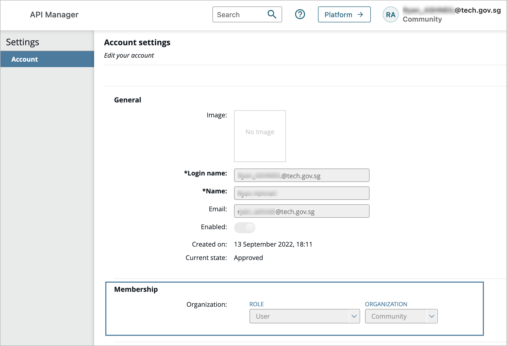

# Onboarding to APEX Cloud as a Publisher

?> Ensure that you have completed the [Pre-onboarding](/sections/onboarding/introduction.md) requirements.

To onboard to APEX Cloud as a Publisher, follow these steps:

1. Log in to the API Manager Portals in the following environments:
    - [Staging (external)](https://go.gov.sg/apex-stg)
    - [Staging (internal)](https://go.gov.sg/apex-int-stg)
    - [Production (external)](https://go.gov.sg/apex)
    - [Production (internal)](https://go.gov.sg/apex-int)

    **Note:** By default, you will be assigned to the `Community Organization` with a user role as a holding ground for your new account. 

    

2. Do one of the folllowing:

    - **If you're a new admin user onboarding to a new Organization:** 
        Use the onboarding ticket to request the APEX team to add your account as an admin for the required Organizations in each API Manager Portal environment.
    
    - **If you're a new user onboarding to an existing Organization:** 
        Request any of your respective Organization admins to add your account(s) to the Organizations that you are a part of, in each of the API Manager Portal environments.

3. Once your account is added to your Organizations, you can switch between your Organizations.

4. Proceed to use APEX Cloud and start managing and publishing APIs. Refer to the [Publisher Guide](/sections/publishing/introduction.md).
