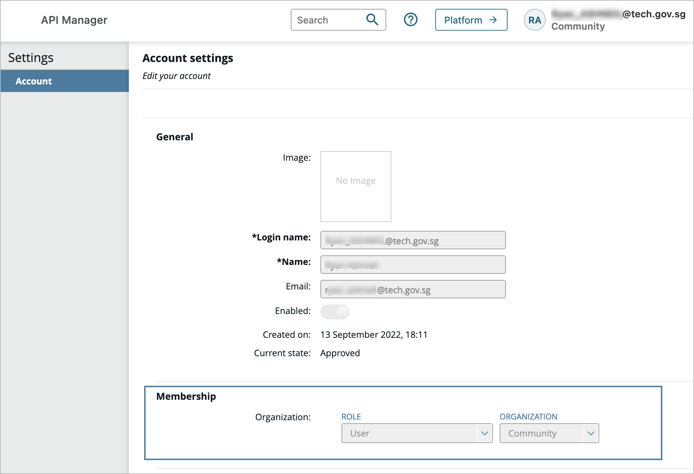

# Onboarding for Public Officers

## What is TechPass?

TechPass is an IAM solution that is equipped with SSO. It taps on [Azure Active Directory](https://azure.microsoft.com/en-us/services/active-directory/), which is an enterprise identity service from Microsoft.

It complies with Government Instruction Manual ICT&SS Management (also known as [IM8](https://www.developer.tech.gov.sg/guidelines/standards-and-best-practices/im8.html)). It utilises popular open standards [OAuth 2.0](https://oauth.net/2/), [OpenID Connect](https://openid.net/connect/), and [Security Assertion Markup Language 2.0](http://sections.oasis-open.org/security/saml/Post2.0/sstc-saml-tech-overview-2.0.html) for authentication and authorisation processes.

## Onboard to TechPass

To kickstart the onboarding process for TechPass, follow the documentation guide [here](https://sections.developer.tech.gov.sg/sections/techpass-user-guide/sign-up-and-onboard-to-techpass).

!> **Important**: In order to access the protected endpoint of the API Manager(s), you will need to **select the option to onboard your Internet device to SEED** during the TechPass onboarding.

You can also view all the available technical documentations for TechPass [here](https://sections.developer.tech.gov.sg/sections?product=TechPass).

## Verify your TechPass account

1. Once you have a valid TechPass account and a device with  SEED enabled, you may proceed to verify your TechPass account by logging in to all the API Manager Portals in the following environments:
    - [Staging (external)](https://go.gov.sg/apex-stg)
    - [Staging (internal)](https://go.gov.sg/apex-int-stg)
    - [Production (external)](https://go.gov.sg/apex)
    - [Production (internal)](https://go.gov.sg/apex-int)

    !> **Important:** Verifying your account in all environments is a **required** step as it will create your user account within the Manager portal.

    Upon first login, you will be assigned to the `Community Organization` with a user role as a holding ground for your new account. 

    

2. After you have verified that you can successfully log in to all the API Manager Portal environments, you may proceed to request your respective organisation admins to add your account(s) into the organisations that you are part of, in all 4 API Manager Portal environments.
