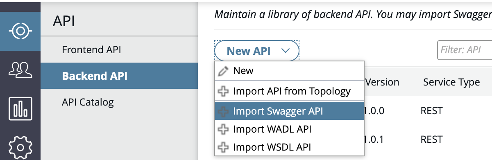
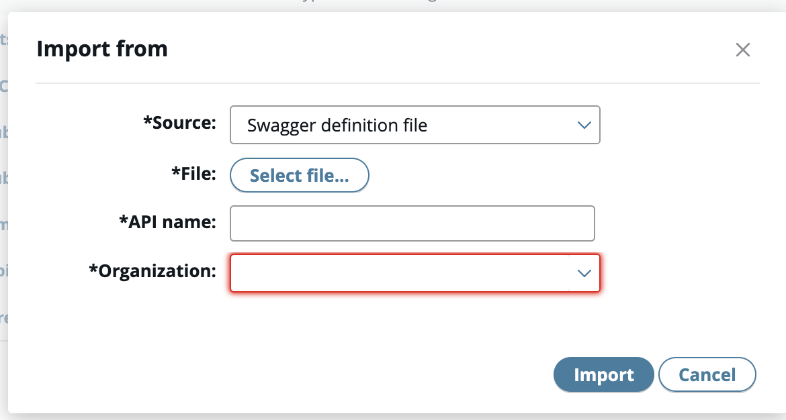
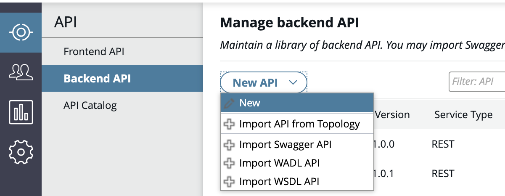
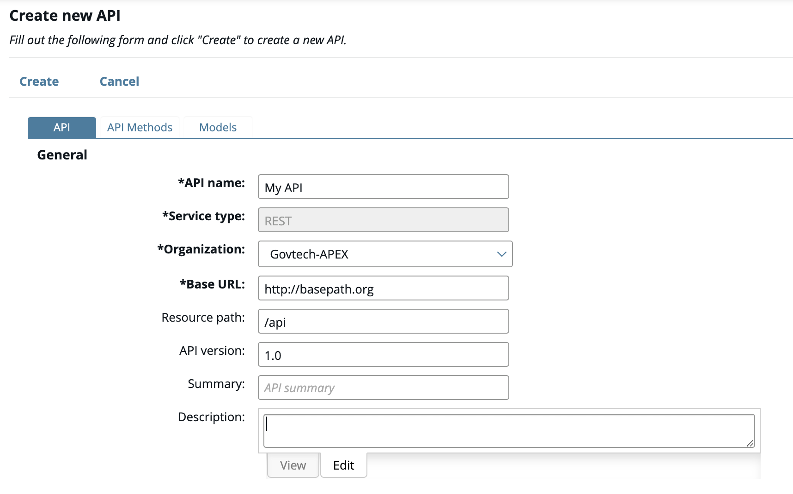
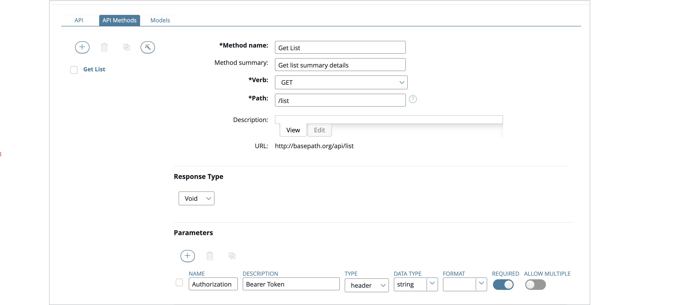
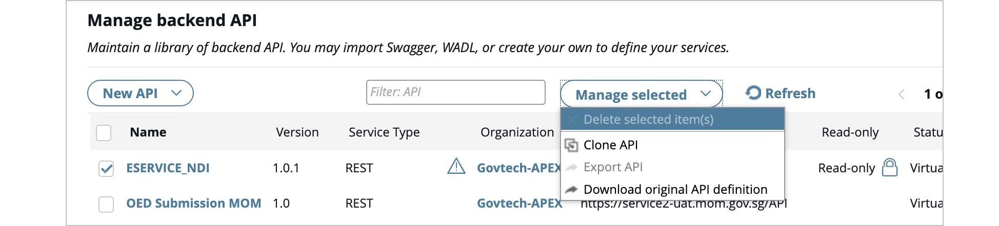

# Create an API

The first step to creating an API is to create a Backend API. 

## Create a Backend API

1. Choose a method from the tabs below to create a backend API.

<!-- tabs:start -->

### **Import a Swagger or WADL file/URL**

1. Click the **API > Backend API** view in API Manager.
2. Click **New API** and select one of the following:
   - **Import Swagger API**: Import an API in Swagger or OpenAPI Specification format.
   - **Import WADL API**: Import an API in Web Application Description Language (WADL) format.
   - **Import WSDL API**: Import an API in Web Services Description Language (WSDL) format from URL.

3. In the Import from API dialog, complete the following:
   - **Source**: Select the source type from the list.
   - **File or URL**: Click the browse button to select the definition file or enter the URL.
   - **API Name**: Enter a name for the API.
   - **Organization**: Select the organization from the list.
   - **Authentication**: (WSDL API only) Enter a User name and Password if required.
   
4. Click import and select the API created.
5. The information will be display in the **API tab** and only the API name can be changed.
6. Proceed to [create API methods](#step-2-create-rest-api-methods).

> **Notes:**
> - Do not use spaces in the URL. Spaces are encoded as `%20` and will be appended in the base path URL.
> - Swagger and WADL API is displayed as read-only in API Manager after the REST API is imported.

### **Manually register a new backend REST API**

1. Click the **API > Backend API** view in API Manager.
2. Click **New API > New**.
   
3. In the **API tab**, complete the following:
   - **API name**: Enter a required name for the API.
   - **Service type**: Default to REST.
   - **Organization**: Select a required organization for the API.
   - **Base path URL**: Enter a resource path. 
       Example: `https://public.api.gov.sg`
   - **Resource path**: Enter a resource path for the API. 
       Example: `/cpf/healthcareCommon/v1` 
       Recommended formats:
       - `/<agency>/<project>/<major version>/<resource>` - `/<agency>/<project>/<major version>/<resource>/<subresource>` -`/<agency>/<project>/<major version>/<resource>/<variable path>`
        Note: For clarity, we suggest using `kebab-case` for your endpoints. Alternatively, `camelCase` or `underscore_case` can also be used.
   - **API version**: Enter an optional version number for the API. Defaults to 1.0.
   - **Summary**: Enter an optional summary for the API to display in the API Catalog.
   - **Description**: Click the **Edit** tab, and enter an optional description for the API.
   - **DGP Sub System ID**: The System ID that your app will be under, found in Digital Governance Platform.
4. Proceed to [create API methods](#step-2-create-rest-api-methods).
   

<!-- tabs:end -->

<!-- 

### Importing a Swagger or WADL file/URL

1. Click the **API > Backend API** view in API Manager.
2. Click **New API** and select one of the following:
   - **Import Swagger API**: Import an API in Swagger or OpenAPI Specification format.
   - **Import WADL API**: Import an API in Web Application Description Language (WADL) format.
   - **Import WSDL API**: Import an API in Web Services Description Language (WSDL) format from URL.

3. In the **Import from** API dialog, complete the following:

- **Source**: Select the source type from the list.
- **File or URL**: Click the browse button to select the definition file or enter the URL.
- **API Name**: Enter a name for the API.
- **Organization**: Select the organization from the list.
- **Authentication**: (WSDL API only) Enter a User name and Password if required.

4. Click import and select the API created.

5. The information will be display in the **API tab** and only the API name can be changed.

6. Proceed to create API methods.

Notes:

- Do not use spaces in the URL. Spaces are encoded as `%20` and will be appended in the base path URL.
- Swagger and WADL API is displayed as read-only in API Manager after the REST API is imported.

### Manually registering a new backend REST API

1. Click the **API > Backend API** view in API Manager.

2. Click **New API > New**.

3. In the **API tab**, complete the following:

   - **API name**: Enter a required name for the API.
   - **Service type**: Default to REST.
   - **Organization**: Select a required organization for the API.
   - **Base path URL**: Enter a resource path. 
       Example: `https://public.api.gov.sg`
   - **Resource path**: Enter a resource path for the API. 
       Example: `/cpf/healthcareCommon/v1` 
       Recommended formats:
       - `/<agency>/<project>/<major version>/<resource>` - `/<agency>/<project>/<major version>/<resource>/<subresource>` -`/<agency>/<project>/<major version>/<resource>/<variable path>`
        Note: For clarity, we suggest using `kebab-case` for your endpoints. Alternatively, `camelCase` or `underscore_case` can also be used.
   - **API version**: Enter an optional version number for the API. Defaults to 1.0.
   - **Summary**: Enter an optional summary for the API to display in the API Catalog.
   - **Description**: Click the **Edit** tab, and enter an optional description for the API.
   - **DGP Sub System ID**: The System ID that your app will be under, found in Digital Governance Platform.

4. Proceed to create API methods.

-->

### Create REST API methods

1. In the API Methods tab, complete the following:
   - **Method Name**: Enter a required name for the API method, and enter an optional Method summary.
   - **Verb**: Enter a required HTTP verb for the API method. 
    Example: `POST`, `GET`, `PUT`
   - **Path**: Enter the path for the method. Paths should start with a `/` and end with a letter.
    Example: `/getAuthenticationToken`
   - **Description**: Click the **Edit** tab, and enter an optional description for the API.
2. To add a parameter exposed by the API method, click the add button in the **Parameters** section, and complete the following:
   - **NAME**: Enter a required name for the parameter.
   - **DESCRIPTION**: Enter an optional description for the parameter.
   - **TYPE**: Select the parameter type. Defaults to *query*.
   - **DATA TYPE**: Select the parameter data type. Defaults to *string*.
   - **REQUIRED**: Specify whether the parameter is required. Defaults to *No*.
   - **ALLOW MULTIPLE**: Specify whether multiple parameters are allowed. Defaults to *No*.
   
3. Click the plus **(+)** button in the *Consumes content-type* section to specify content types that can be consumed by the API method.
4. Click the plus **(+)** button in the *Response codes* section to specify response codes that can be produced by the API method, , and select the response codes.
5. Click **Add** to add the new API method.
6. (Optional) *Create the REST API data model: Model* describes the payload and the return data of the API.
> **Note:** Data model can only be added or edited when you create the REST API manually. It will only be read-only for imported REST API. If editing is required, clone the API, as described in the next section.

## Manage the Backend API Lifecycle

1. Click **API > Backend API** in API Manager.
2. Select an API.
2. Click **Manage Selected** and select any of the following:
   - **Delete**: Delete APIs created as front-end APIs in the Frontend API view.
   - **Clone API**: Clone a back-end API imported from a WSDL-based web service.
   - **Export API**: Import this into another API Manager environment as a back-end API.
   - **Download original API description**: Downloads a copy of the original REST API definition.

## What's Next

Proceed to [create a Frontend API and publish your API](/sections/publishing/publish-api.md).