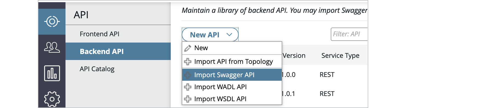
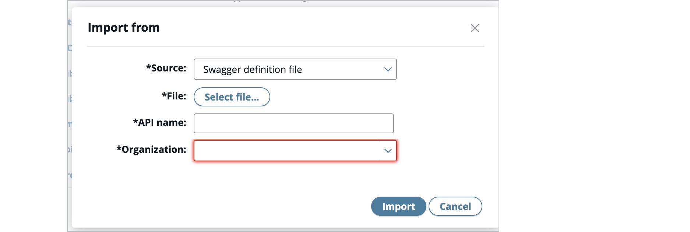
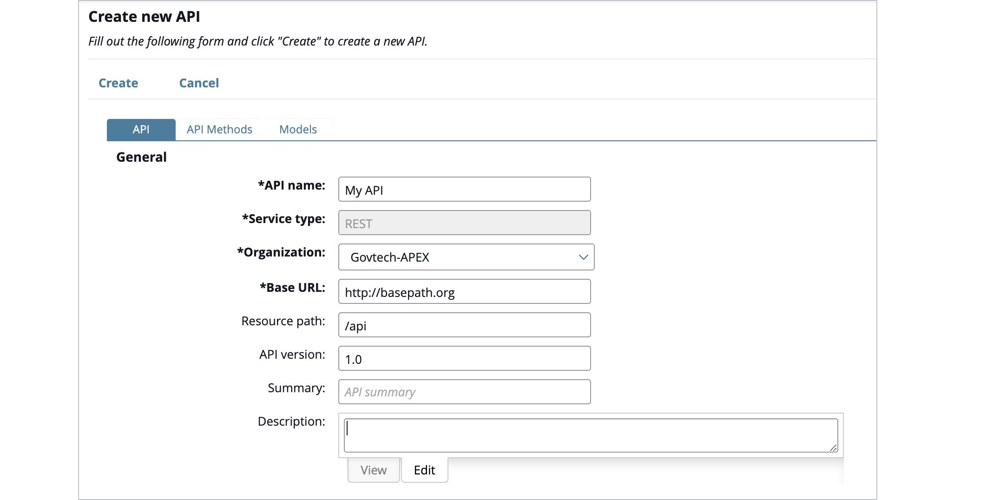

# Create REST API (Backend API)

## Import using swagger file or WADL file / url

1. Click the **API > Backend API** view in API Manager.
2. Click **New API** and select one of the following:
   - **Import Swagger API**: Import an API in Swagger (OpenAPI Specification) format.
   - **Import WADL API**: Import an API in Web Application Description Language (WADL) format.
   - **Import WSDL API**: Import an API in Web Services Description Language (WSDL) format from URL.

3. In the import API dialog, complete the following:

- **Source**: Select the source type from the list.
- **File or URL**: Click the browse button to select the definition file, or enter the URL.
- **API Name**: A name for the API.
- **Organization**: Select the organization from the list.
- **Authentication**: (WSDL API only) Enter a User name and Password if required.

4. Click import and select the API created.

5. The information will be display in the **API tab** and only the API name can be changed.

Note:

- Do **not** use spaces or the URL encoded %20 will be appended in the base path URL.
- Swagger and WADL API is displayed as read-only in API Manager after the REST API is imported.

## Manually register a new back-end REST API

1. Click the **API > Backend API** view in API Manager.

2. Click **New API > New**.

3. In the **API tab**, complete the following:

   - **API name**: Enter a required name for the API.
   - **Service type**: Default to REST.
   - **Organization**: Select a required organization for the API.
   - **Base path URL**: Enter a resource path. Defaults to http://basepath.org.
   - **Resource path**: Enter a resource path for the API. Defaults to /api.
   - **API version**: Enter an optional version number for the API. Defaults to 1.0.
   - **Summary**: Enter an optional summary for the API to display in the API Catalog.
   - **Description**: Click the Edit tab, and enter an optional description for the API.
   - **DGP Sub System ID**: The System ID that your app will be under (found in Digital Governance Platform)

## Create REST API methods

1. In the **API Methods tab**, complete the following:

   - **Method Name**: Enter a required name for the API method, and enter an optional Method summary.
   - **Verb**: Enter a required HTTP verb for the API method. Defaults to GET.
   - **Path**: Enter the path for the method. Defaults to /.
   - **Description**: Click the Edit tab, and enter an optional description for the API.

2. To add a parameter exposed by the API method, click the add button in the **PARAMETERS** section, and complete the following:

   - **NAME**: Enter a required name for the parameter.
   - **DESCRIPTION**: Enter an optional description for the parameter.
   - **TYPE**: Select the parameter type. Defaults to query.
   - **DATA TYPE**: Select the parameter data type. Defaults to string.
   - **REQUIRED**: Select whether the parameter is required. Defaults to No.
   - **ALLOW MULTIPLE**: Select whether multiple parameters are allowed. Defaults to No.

3. To specify **content types** that can be consumed by the API method, click the plus (+) button in the Consumes content-type section, and enter the content type.

4. To specify **response codes** that can be produced by the API method, click the plus (+) button in the Response codes section, and select the response codes.

5. Click **Add** to **add the new API method**.

6. (Optional) Create the REST API data model: Model describes the payload of the api and the return data of the API.

Note:

- Data model can only be add / edit when you create REST API manually. However, it will only be read-only for imported REST API. If edit is required, clone the API as described in the next section.

## Manage Backend API Lifecycle

1. Click **API > Backend API view > Select API** in API Manager.
2. Click **Manage Selected** and select any of the following
   - **Delete**: Delete APIs created as front-end APIs in the Frontend API view.
   - **Clone API**: Clone a back-end API imported from a WSDL-based web service.
   - **Export API**: Import this into another API Manager environment as a back-end API.
   - **Download original API description**: Downloads a copy of the original REST API definition.

