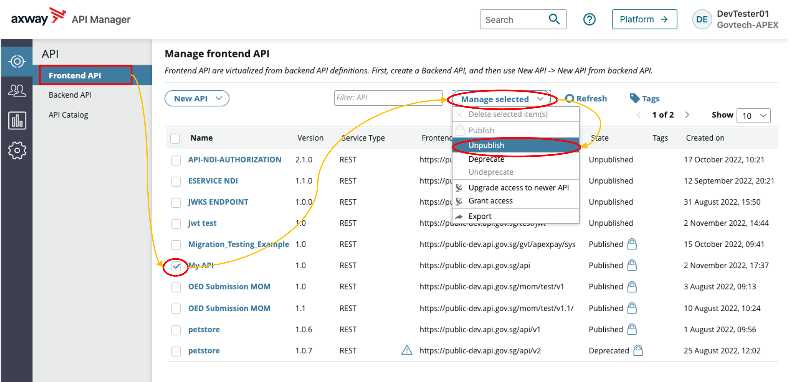
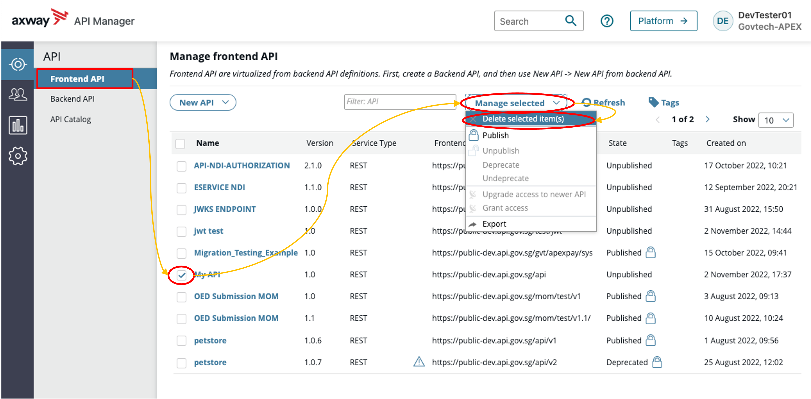
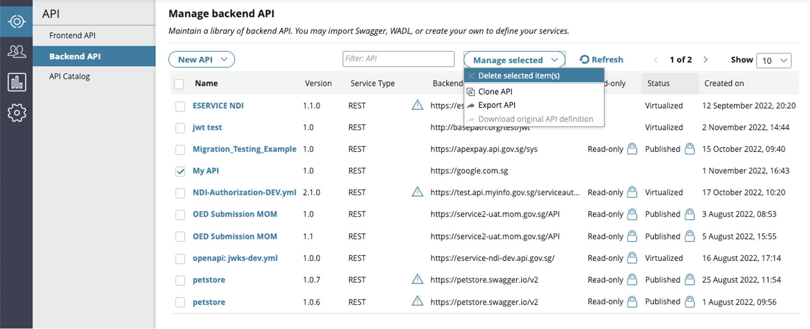

# Deleting APIs

!> Unpublishing and deleting APIs will unlink any linked applications.

- Step 1: [Unpublish Frontend API](#unpublish-frontend-api)
- Step 2: [Delete Frontend API](#delete-frontend-api)
- Step 3: [Delete Backend API](#delete-backend-api)

## Unpublish Frontend API

1. Click **API > Frontend API view > Select API** in API Manager.
2. Click **Manage Selected** and select **Unpublish**.

## Delete Frontend API

1. Click **API > Frontend API view > Select API** in API Manager.
2. Click **Manage Selected** and select **Delete selected item(s)**.

## Delete Backend API

1. Click **API > Backend API view > Select API** in API Manager.
2. Click **Manage Selected** and select **Delete selected item(s)**.

