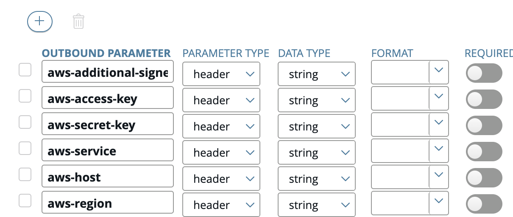

# Publish API (Frontend API)

## Create New API

### Import from Backend API

1. Click **API > Frontend API** in API Manager.
2. Click **New API > New API from backend API**.


3. Select an existing back-end API in the dialog, and click **Create**.


### Import API via .dat file

1. Click **API > Frontend API view** in API Manager.
2. Click **New API > Import API collection**.
3. In the **Import** from dialog, complete the following:
   - **File**: Click to browse to the previously exported API (.dat file).
   - **Password**: Enter the password if required.
   - **Organization**: Select the organization from the list.
4. Click **Import**.
5. **Press F5** to **reload** the API Manager web console.


## Configure Inbound Request Settings

Configuration for inbound request settings between the publisher and the API Gateway:

1. Select **Inbound** tab.
2. Edit **Resource** path for the API.
   
   > The convention for `Resource path` is:
   >
   > https://public.api.gov.sg/{agency_id}/{product_name}/v{version}/{endpoint}
3. Select API Key from **Inbound Security** list.
   - **API key field name**: Enter name for API key field in the inbound request.
   - **API key location**: Select Request Headers or Query string/form body.
   - **Remove credentials on success**: Default to enable it. Inbound authorization header will be removed to use different authentication method for the outbound to the backend services.
     
4. Click the **Advanced** button on the right to configure settings such as monitoring, sharing resources across domains, and per-API method overrides.

## Configure Outbound Request Settings

Configuration of the outbound request settings between the API Gateway and the backend services:

1. Select **Outbound** tab.
2. Validate **Backend service URL** and change if necessary.
3. Select an **authentication profile** for the backend services.
   - [No Authentication](#no-authentication)
   - [HTTP Basic authentication](#http-basic-authentication)
   - [API Key authentication](#api-key-authentication)
   - [SSL authentication](#ssl-authentication)
   - [OAuth authentication](#oauth)
     
4. Click the **Advanced** button on the right to configure settings such as request or response processing, routing, and per-API method overrides. Select the request policy when necessary.
   - [Generate_AWS_SigV4](#generate-aws-sigv4)
   - [Verify_JWT](#verify-jwt)
   - [Verify_JWT_And_Generate_AWS_SigV4](#verify-jwt-and-generate-aws-sigv4)
     
5. Click **Apply**.

Note:

- Advance option can be use in situation where additional headers (e.g. client ID and secret) are required.

### No Authentication

No authentication is performed between the API Gateway and the backend API.

### HTTP Basic Authentication

**Name**: Enter a required name for the profile. Defaults to HTTP Basic.

**Username**: Enter the required username (API key).

**Password**: Enter the optional password (API secret).

### API Key Authentication

**Name**: Enter a required name for the profile.

**API key field name**: Enter name for API key field in the outbound request.

**API key**: Enter the API key.

**Pass credentials as HTTP**: Select Header, Query string or Form of the API key in the outbound request.

### SSL authentication

This certificate will be used as the client certificate for communication with the publisher.

**PFX/P12 file**: Select the desired certificate file.

**PFX/P12 password**: If certificate is password protected, please enter the password.

**Trust all certificates in chain**: Select whether to trust all the CA certificates in the certificate chain. If this is not selected, only the top-level CA is trusted. This setting is selected by default.

### OAuth

This creates an outbound OAuth authentication with Microsoft Online OAuth service.

**Provider Profile**: Select Microsoft Profile

**Token Key**: Leave as ${authentication.subject.id}


Click on Advanced button on top right of the screen, a Per-Method Override drop down should appear at bottom of the window. Select your API method and click on Edit API Proxy.

Add the following outbound parameters as Parameter Type: header, and add in their respective values obtained from the Microsoft OAuth server:

- x_apex_tenantid
- x_apex_scope
- x_apex_clientid
- x_apex_secret


This outbound authentication profile should add the respective Authorization Bearer Token obtained from Microsoft's OAuth server.

### Generate AWS SigV4

Generate_AWS_SigV4 generates AWS signature, and adds Authorization and amzdate to the headers in the outbound between APEX-cloud gateway and AWS gateway. See [AWS Signature Version 4 signing process](https://docs.aws.amazon.com/general/latest/gr/signature-version-4.html).

Signing additional header(s) is supported by providing the header field name(s), e.g. x-apigw-api-id, as aws-additional-signed-headers and the value(s) in the header. Multiple headers are allowed using the correct format.

```
aws-additional-signed-headers: header1;header2;header3
header1: value1
header2: value2
header3: value3
```

Steps

1. Select **Outbound** tab.
2. Choose **No Authentication** in **authentication profile**
3. Select **Generate_AWS_SigV4** in **Request Policy**.
4. Expand **pre-method override** > Click **(+) sign** > Select **API**.
5. Click **Edit API Proxy**.
6. Input the necessary parameters

   - **aws-access-key**: AWS client access key.
   - **aws-secret-key**: AWS client secret key.
   - **aws-service**: AWS services e.g. execute-api.
   - **aws-host**: AWS domain name or endpoint.
   - **aws-region**: AWS region.
   - **aws-additional-signed-headers**: (Optional) Additional headers that required to be signed.
     

7. Click **Apply**.

Note:

- Empty string is the default value if the params.headers value is null or undefiend. This may cause the signature generated to be invalid.
- Additional headers value need to be present. Else, there will be error generating the signature.

### Verify JWT

Verify_JWT provides **oauth2.1** authorization to **verify Authorization header**. Consumer's application should **onboard to OAuth2.1** via [Developer Portal](https://www-dev.api.developer.tech.gov.sg/) to access **API(s) that use JWT_Verify as the request policy**. Refer to [Onboard to OAuth2.1](docs/dev/oauth.md).

Guide to test your API with Verify_JWT.

1. Onboard to **OAuth2.1**.
2. Add **API (With Verify_JWT)**.
3. Get **Authorization Token**. <!-- Refer to (TODO: Update the link or document name) on the guide to get the token. -->
4. Add **Authorization token** with **ApiKey** in the **header** to **access the API**.


### Verify JWT And Generate AWS SigV4

This policy **combined** both **Veryify_JWT** and **Generate_AWS_SigV4** as the authentication between gateway and publisher gateway.

### Network routing from APEX Cloud to Publisher Server

**Internet Environment** : "API Proxy" in Default method routing will be used for Bridging APIs, APEX Cloud internet APIs (other organisation APIs) and Proxy APIs (Publisher backend Server)

**Intranet Environment** : "API Proxy" in Default method routing will be used for Proxy APIs (Publisher backend Server)


**Intranet Environment** : "APEX_Routing" in Default method routing will be used for  bridging APIs Or APEX Cloud Intranet APIs (other organisation APIs)


## API Method

API Method display the list of method(s) and it provides build-in test to check if APIs is functioning as expected before publication.

1. Click **API > Frontend API view**.
2. Select **API > click API Method** tab.
3. Click **Try Method** to perform the test for any endpoint(s) specified.

?> **Note:** The **Try method** option is only applicable to APEX Cloud **Internet** endpoint(s) that are specified in the API Manager Internet.  For APEX Cloud **Intranet** endpoint(s), we recommend testing using programming tools such as Curl, Postman, or  SOAP UI from a server with connectivity to APEX Cloud since the **Try method** option will always return a false negative `0` status for Intranet endpoint(s).


Alternatively, testing can also be done in API Catalog.

1. Click **API > API Catalog**.
2. Select **API** for display.
3. **Add authentication** required as specified.
4. Click **Try it** to perform the test.

## Trusted Certificates

Trusted Certificates display the set of certificates to be used for verification of the backend endpoint (the Publisher's API, except for bridging API) during TLS handshake. CA certificates should be automatically uploaded during the setup of the Frontend API.

**Note:** For more information, refer to [List of Trusted Certificate Authorities](/sections/faqs/trusted-cert-authorities.md).

If the desired root CA certificate corresponding to the backend API  is not listed, you may proceed with the below steps to upload the root CA certificate.
1. Click **Trusted Certificates** tab.
2. Click on the (**+**) sign.
3. Select the desired certificate to upload.
   
   
4. Ensure that the **Use for outbound** toggle button is checked.
5. Click **Import** to import the certificate.

### Bridging APIs

If the target endpoint is in the APEX Cloud Intranet zone, use: 

- SGCORE Root CA - **SOEASYRCA-G1**
- AWS Root CA certs -  **All AWS Root CA**

If the target endpoint is in APEX Cloud Internet zone, use:

- Sectigo Root CA - **USERTrust RSA Certification Authority**


## Publish API

1. Click **API > Frontend API view > Select API** in API Manager.
2. Click **Manage Selected** and select **Publish**.
   
3. Enter **Virtual Host** and click **Publish**.

   !> **Note:** To publish this API in a testing or Sandbox environment for non-government developers, you can enter the following URL in the Virtual Host field: **sandbox.api.gov.sg**. Next, you can follow the steps on [making your Sandbox API discoverable](/sections/publishing/making-api-discoverable.md).

4. Published API will be able to access via https://{virtual-host}/{prefix-path}/{method-path}.

## Manage Frontend API Lifecycle

1. Click **API Registration > Frontend API view** in API Manager.
2. **Select API**
3. Click **Manage Selected** and select any of the following:
   - **Unpublish API(s)**.
   - **Delete and Update** API(s). Refer to [API versioning](sections/publishing/api-versioning.md) for more details in update API.
   - **Grant access** to organisation(s). Refer to [Manage access to APIs](sections/publishing/manage-access-to-apis.md).
   - **Export API(s)** to .dat extension.
