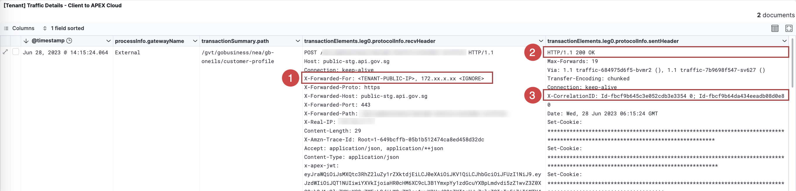

# Debugging API request issues

## Traffic Trace Dashboard

To debug a problematic API request, you can trace the request using the Traffic Trace dashboard.

- [Step 1: Identify the issue](#1-identify-the-issue)
- [Step 2: Troubleshoot the issue](#2-troubleshoot-the-issue)

 When an API request is made, a unique **Correlation ID** is generated and attached to the request message. Yu can use this ID to pinpoint the source of the error or issue and identify the root cause of the problem.

The Traffic Trace Dashboard helps you view and filter the list of the Correlation IDs and the details of each API request. 

### Dashboard panels

The dashboard consists of four panels.

| Panel | Description |
| --- | --- |
| **Traffic Summary** | Lists all the Correlation IDs that occurred in a specific time range. The API requests are listed by  Correlation ID.   Traffic summary logs are retained for a duration of 365 days. |
| **Traffic Details - Client to APEX Cloud** | Shows the detailed results of the API request segment between the Client and APEX Cloud (Leg 0).  Traffic details logs are retained for a duration of 30 days. |
| **Traffic Details - APEX Cloud to Endpoint** | Shows the detailed results of the API request segment between APEX Cloud and the endpoint (Leg 1).   Traffic details logs are retained for a duration of 30 days. |
| **Traffic Trace Root Cause** | Shows the trace level for the  queried API. The details provided in this panel are used to debug the API request.   Traffic trace logs are retained for a duration of 7 days.

## 1. Identify the issue

### Prerequisites

- An active [TechPass](sections/onboarding/techpass) account.
- Access to your Elastic Cloud deployment.

### View the  dashboard

1. Access your StackOps account.

    - **Production:** [go.gov.sg/apex-report](https://go.gov.sg/apex-report)
    - **Staging:** [go.gov.sg/apex-report-stg](https://go.gov.sg/apex-report-stg)

1. Log in with [TechPass](sections/onboarding/techpass). The Elastic Cloud dashboard is displayed.

1. From the Spaces menu, select your project space.

1. From the main menu, go to the Analytics category and click **Dashboard**. A list of available dashboards are displayed in the Dashboards page.

1. From the list of dashboards, click **Traffic trace**. The Traffic Trace dashboard is displayed.

### Find the Correlation ID

1. On your Traffic Trace dashboard, configure the dashboard filters to narrow down the list of API requests in the Traffic Summary panel.

    > **Note:** You can choose to skip this step and proceed to browse the list of API requests in the Traffic Summary panel. These requests will be sorted based on the default time range that is set in your dashboard.

    

    | Filter | Description | Used for |
    | --- | -- | -- |
    | **(1) Time range** | Specifies the time range that the API was processed. | All panels
    | **(2) CorrelationID** | Filters or identifies a specific API request in a query. | All panels
    | **(3) App Org** | Filters the requests by application's consumer  organization | Traffic Summary panel
    | **(4) App Name** | Filters the requests by application name | Traffic Summary panel
    | **(5) Gateway** | Filters the gateway type by either **internal** or **external** values. | Traffic Summary panel
    | **(6) API Final Status** | Filters the status of the request by either **Pass** or **Fail** values. | Traffic Summary panel
    | **(7) Log level** | Filters the log levels in the Traffic Trace panel. | Traffic trace panel |

2. Browse through the list of API requests in the Traffic Summary panel, and copy the **Correlation ID** of the problematic request.

    > **Note:** These logs are retained for a duration of 365 days.

    

    > **Note:** You can also hover over the Correlation ID entry and  click the (**+**) icon to filter the results by that value.

<!-- 

### Step 3: Debug the problematic request

?> Make sure to clear any filters that you used to find the Correlation ID.

1. In the Correlation ID filter, paste the value of the Correlation ID that corresponds to the problematic API request.

    

1. After filtering by the Correlation ID, debug the request using the **Traffic Details** and **Traffic Trace Root Cause** panels. Proceed to the next sections.

-->

## 2. Troubleshoot the issue

To debug the issue, check the Traffic Details of the correlation ID. Follow these steps.

1. In the Correlation ID filter, enter the Correlation ID that corresponds to the problematic API request. 

?> Ensure you've cleared any previous filters used to find the Correlation ID in Step 1.

2. Review the traffic details in the following panels:

-  [Client to APEX Cloud Traffic Panel](#panel-1-client-to-apex-cloud)
-  [APEX Cloud to Endpoint Traffic Panel](#panel-2-apex-cloud-to-endpoint)
-  [Traffic Trace Root Cause Panel](#panel-3-traffic-trace-root-cause)

### Panel 1: Client to APEX Cloud

This panel helps you determine if the issue occurs in the Client to APEX Cloud segment of the request (Leg 0).
> **Note:** These logs are retained for a duration of 30 days.

Check the following parameters to troubleshoot the issue:

- (**1**) The **X-Forwarded-For**  header is used to verify the Client IP address. In this parameter, `X-Forwarded-For: <TENANT-PUBLIC-IP>, <proxy1>, <proxy2>`, the `TENANT-PUBLIC-IP` value indicates the Source IP address of the application that initiated the API request.

- (**2**) The **HTTP response** shows the response received from APEX Cloud. For example, a response with a `446 Client Error` code can be checked against [JWT error codes](/sections/troubleshooting/jwt.md).

    

- (**3**) The **X-CorrelationID** header can be used to indicate a **Bridging API** when there are two correlation ID values.   

    - The second or last appended correlation ID corresponds to the second bridge or leg, known as Leg 1.
    - To trace and troubleshoot issues related to the second bridge or leg, use the second or last appended correlation ID.

### Panel 2: APEX Cloud to Endpoint

Use this panel to determine whether an API request is experiencing failure on the APEX Cloud to Endpoint segment of the request (Leg 1).

> **Note:** These logs are retained for a duration of 30 days.

Check the **HTTP response** displayed in the Received Header column. This is the response received from the backend.

In the example above, the response is `HTTP/1.1 404 Not Found`. This indicates that the backend server is throwing an error. The API publisher can refer to the specific error provided to troubleshoot the issue.

###  Panel 3: Traffic Trace Root Cause

 Use this panel to check the log details in the **message** column and get more insight on the cause of the issue.

 > **Note:** These logs are retained for a duration of 7 days.

## Export the trace logs

To export the track trace logs in `.csv` format, follow these steps:

1. Hover over the upper right area of the Traffic Trace panel and click the menu icon.

1. Click **More**.

1. Click **Download CSV**.

    
