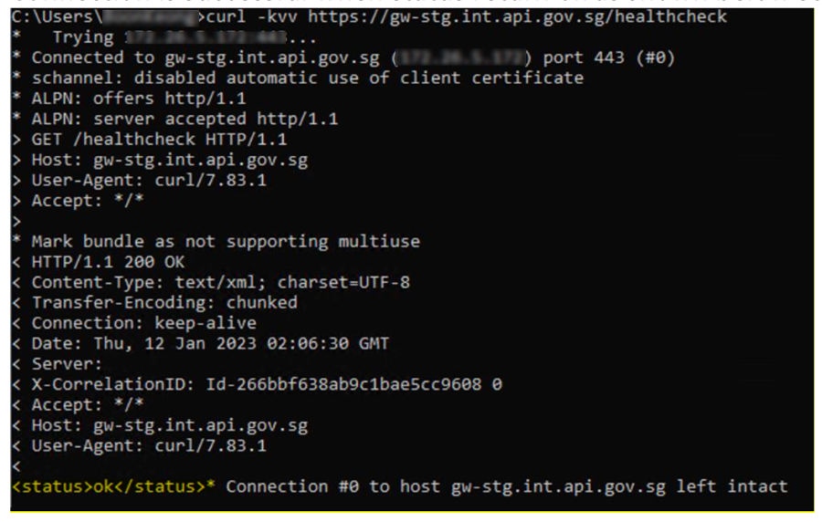
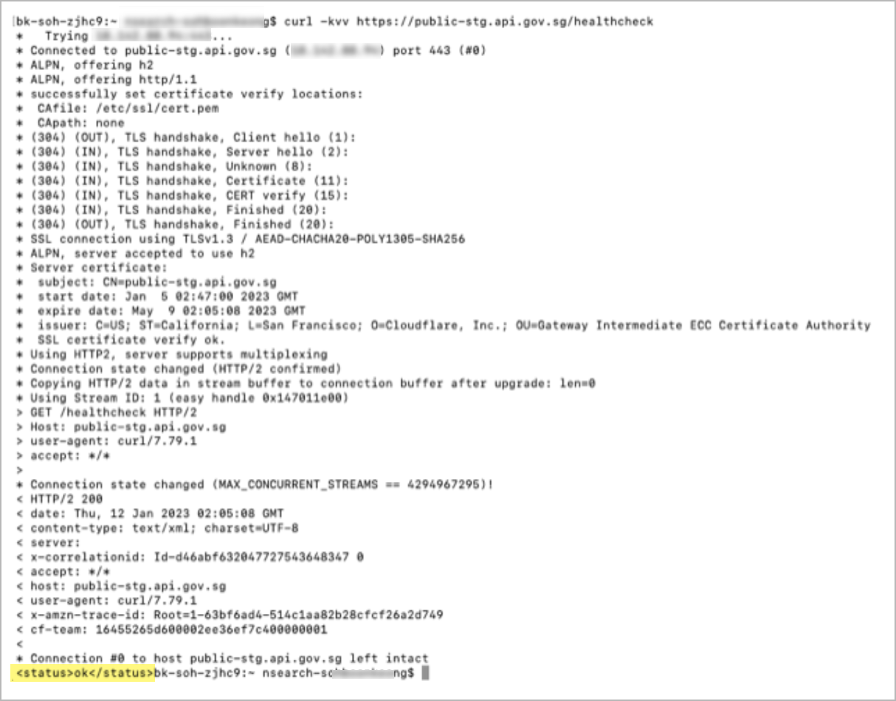
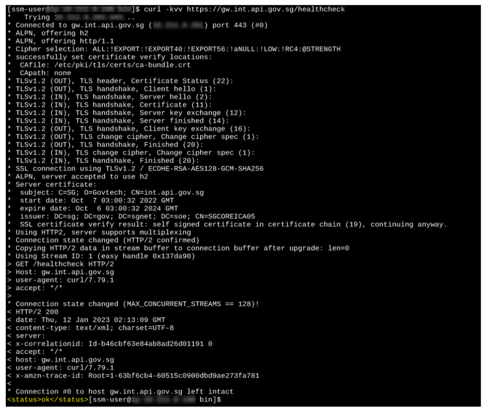
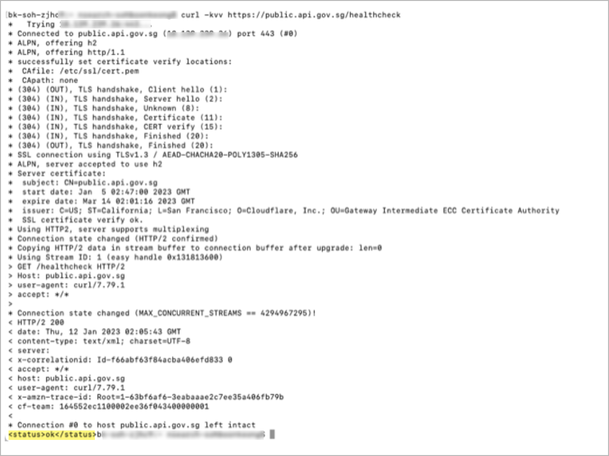
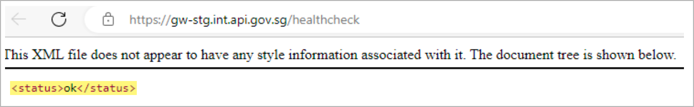
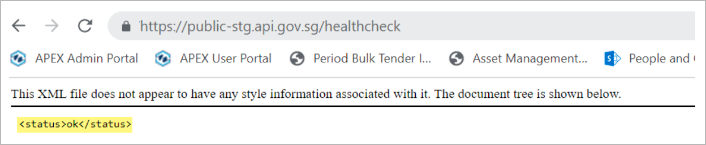
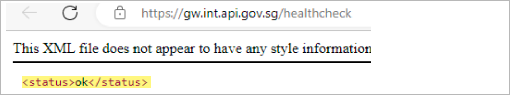
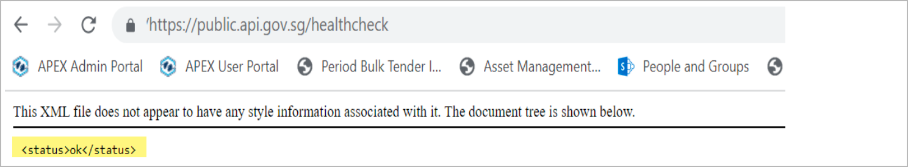

# Network connectivity issues

- [General network issues](#general-network-issues)
- [SSL/TLS issues](#ssltls-issues)

## General network issues

**Solution:** To diagnose any network issues, you can perform a network connectivity test on your server. This test should be performed from the same zone, either **internet** or **intranet**, from which you are making API requests.

There are two methods to perform the network connectivity test:

- [Option 1: Test using cURL](#option-1-test-using-curl)
- [Option 2: Test using a browser](#option-2-test-using-a-browser)

If at least one of the testing methods is successful, it indicates that the network connectivity is working as expected.

### Option 1: Test using cURL

Select the appropriate environment in the tabs below to view the sample code to test the network connectivity using cURL.

<!-- tabs:start -->
#### **Staging Intranet**

On an intranet machine, use the sample code below.

```bash
curl -kvv https://gw-stg.int.api.gov.sg/healthcheck 
```

The connection is successful when an `ok status` is returned as shown in the screenshot below.



#### **Staging Internet**

On an internet machine, use the sample code below.

```bash
curl -kvv https://public-stg.api.gov.sg/healthcheck
```

The connection is successful when an `ok status` is returned as shown in the screenshot below.



#### **Production Intranet**

On an intranet machine, use the sample code below.

```bash
curl -kvv https://gw.int.api.gov.sg/healthcheck 
```

The connection is successful when an `ok status`  is returned as shown in the screenshot below.



#### **Production Internet**

On an internet machine, use the sample code below.

```bash
curl -kvv https://public.api.gov.sg/healthcheck 
```

The connection is successful when an `ok status`  is returned as shown in the screenshot below.



<!-- tabs:end -->

### Option 2: Test using a browser

Select the appropriate environment in the tabs below to view the sample code to test the network connectivity using a browser.

<!-- tabs:start -->

#### **Staging Intranet**

In your browser, open this URL: [https://gw-stg.int.api.gov.sg/healthcheck](https://gw-stg.int.api.gov.sg/healthcheck)

The connection is successful when an `ok status` is returned as shown in the screenshot below.



#### **Staging Internet**

In your browser, open this URL: [https://public-stg.api.gov.sg/healthcheck](https://public-stg.api.gov.sg/healthcheck)

The connection is successful when an `ok status` is returned as shown in the screenshot below.



#### **Production Intranet**

In your browser, open this URL: [https://gw.int.api.gov.sg/healthcheck](https://gw.int.api.gov.sg/healthcheck)

The connection is successful when an `ok status` is returned as shown in the screenshot below.



### **Production Internet**

In your browser, open this URL: [https://public.api.gov.sg/healthcheck](https://public.api.gov.sg/healthcheck)

The connection is successful when an `ok status` is returned as shown in the screenshot below.



<!-- tabs:end -->

## SSL/TLS issues

**Solution:** To troubleshoot SSL/TLS errors, ensure that your system supports the TLS protocol and cipher suites that are supported by APEX Cloud.

1. To retrieve a list of available cipher suites on your system, run the following **PowerShell** command: `Get-TlsCipherSuite | ft Name`

2. Next, you can refer to the tables below to see the TLS protocol and cipher suites supported by the APEX Cloud Intranet and Internet API Gateway. 

    ### Intranet API Gateway

    | TLS Protocol Version | TLS Cipher Suites |
    | -- | -- |
    | Protocol-TLSv1.2 | ECDHE-ECDSA-AES128-GCM-SHA256<br> ECDHE-ECDSA-AES256-GCM-SHA384<br> ECDHE-RSA-AES128-GCM-SHA256<br> ECDHE-RSA-AES256-GCM-SHA384<br>

    ### Internet API Gateway

    | TLS Protocol Version | TLS Cipher Suites |
    | -- | -- |
    | Protocol-TLSv1.2 | ECDHE-RSA-AES128-GCM-SHA256<br> ECDHE-RSA-AES256-GCM-SHA384<br>
